# Zoth Studio v2

> **Zero-Egress Sovereign Agent Development Studio & Pantheon Matrix**  
> *Air-gapped local AI agent orchestration, biomorphic STDP memory, Lucy Netrunner Oracle, 37 sovereign workstations, 25 in-browser micro-tools, 3-agent Byzantine consensus, and Adytum Hardware Sanctum.*

[](#zero-egress-security-invariants)
[](#netlify-deployment-instructions)
[](#prerendered-static-routes-87-total)
[](https://vitejs.dev)
[](https://react.dev)
[](https://mui.com)
[](#windowcarousel--column-stacking-architecture)
[](#lucy-oracle--biomorphic-stdp-synaptic-memory)
[](#license)

---

## System Overview & Core Philosophy

**Zoth Studio v2** is an air-gapped, zero-egress development studio and operator cockpit designed for orchestrating autonomous AI agent pantheons, local model foundries (Ollama, llama.cpp), and biomorphic synaptic memory matrices. Built on a pristine gold-on-void aesthetic (`#D4AF37` on `#08080B`), Zoth Studio v2 decouples complex multi-agent workflows into 37 dedicated workstations and 25 zero-leakage in-browser developer utilities.

- **WHAT THIS IS**: A complete, single-page application (SPA) and loopback development environment for coordinating autonomous AI agent swarms, testing zero-egress developer tools, tuning biomorphic STDP synaptic memories, executing 3-agent Byzantine consensus proofs, and running local models on local silicon.
- **WHAT THIS IS NOT**: This is not a cloud SaaS, does not send prompts or telemetry to third-party endpoints, and does not depend on cloud authentication providers. Everything executes on your physical hardware via loopback enclaves (`127.0.0.1`).
- **WINDOWCAROUSEL ARCHITECTURE**: Unlike tacky dashboards that squish 4+ complex interface windows into a cramped horizontal row, Zoth Studio v2 implements an adaptive `WindowCarousel` architecture across tool suites (WebGen, Memory, Archon Swarms). Operators can glide through full-detail interface cards with generous breathing room or toggle into a clean, stacked single-column view with a single click.

---

## Architectural Topology

### ASCII System Topology

```
+====================================================================================================+
|                                    ZOTH STUDIO v2 OPERATOR DESK                                    |
|                         http://127.0.0.1:3000 (React 18 + MUI v5 Gold-on-Void)                     |
+====================================================================================================+
        |                                     |                                     |
        v                                     v                                     v
+-------------------------------+  +-------------------------------+  +-------------------------------+
|       37 WORKSTATIONS         |  |      25 IN-BROWSER TOOLS      |  |    LUCY NETRUNNER ORACLE      |
|  - Multi-Agent DAG Composer   |  |  - JWT Inspector Guard        |  |  - Codec 141.12 Deep Breach   |
|  - Brand Alchemical Seals     |  |  - Payload Entropy Studio     |  |  - STDP Synaptic Plasticity   |
|  - Sovereign Code IDE         |  |  - Polyglot Exporter          |  |  - Whitespace 3D Constellation|
|  - Cyberpunk HUD Cockpit      |  |  - UFO Sacred Geometry        |  |  - SQLite HNSW Vectors        |
|  - AI Model Foundry           |  |  - CWV Speed Engine           |  |  - Port 8788 (Loopback)       |
+-------------------------------+  +-------------------------------+  +-------------------------------+
        |                                     |                                     |
        +-------------------------------------+-------------------------------------+
                                              |
        +-------------------------------------+-------------------------------------+
        |                                     |                                     |
        v                                     v                                     v
+-------------------------------+  +-------------------------------+  +-------------------------------+
|  3-AGENT BYZANTINE CONSENSUS  |  |    ADYTUM HARDWARE SANCTUM    |  |     ZERO-EGRESS GUARANTEE     |
|  - Proposer Agent (AST Diff)  |  |  - 22-Key Cryptographic Gate  |  |  - Loopback Only (127.0.0.1)  |
|  - Evaluator Agent (Entropy)  |  |  - 5-Min Incubation Lock      |  |  - Shannon Entropy Gating     |
|  - Arbiter Agent (Verdict)    |  |  - Argon2id KDF Memory Hard   |  |  - 0 Cloud Telemetry / Beacons|
|  - 3/3 Cryptographic Seal     |  |  - XChaCha20-Poly1305 Vault   |  |  - No eval() / new Function() |
+-------------------------------+  +-------------------------------+  +-------------------------------+
        |                                     |                                     |
        v                                     v                                     v
+-------------------------------+  +-------------------------------+  +-------------------------------+
|      LOCAL BACKEND DAEMONS    |  |   NETLIFY EDGE PRERENDER      |  |   AEO / AX MACHINE DISCOVERY  |
|  - Neuro Memory :8788 (Python)|  |  - 87 Prerendered Routes      |  |  - /llms.txt & /llms-full.txt |
|  - Signal Bridge :8789 (IPC)  |  |  - Serverless Proxy Functions |  |  - /ai.txt Crawler Contract   |
|  - Hardware Vault :8787 (Rust)|  |  - Strict Security Headers    |  |  - /sitemap.xml (87 Entries)  |
|  - Ollama / llama.cpp :11434  |  |  - Immutable Asset Caching    |  |  - /api/ax/manifest.json      |
+-------------------------------+  +-------------------------------+  +-------------------------------+
```

### Mermaid Architecture Topology

```mermaid
flowchart TD
    subgraph Client["Zoth Studio v2 Frontend (Loopback Enclave)"]
        UI["Operator Deck UI<br/>http://127.0.0.1:3000<br/>React 18 + MUI v5"]
        WS["37 Sovereign Workstations<br/>DAG Composer, Code IDE, Model Foundry"]
        Tools["25 In-Browser Tools<br/>JWT Guard, Shannon Entropy, Exporters"]
        UI --> WS
        UI --> Tools
    end

    subgraph Memory["Lucy Netrunner Oracle & Whitespace Cyberspace"]
        Lucy["Lucy Oracle Core<br/>Codec 141.12 // Deep Net Breach"]
        STDP["STDP Synaptic Plasticity Engine<br/>dw = A+ exp(-dt/tau)"]
        HNSW["SQLite Vector Tables & HNSW Index<br/>Port 127.0.0.1:8788"]
        Lucy --> STDP --> HNSW
    end

    subgraph Consensus["3-Agent Byzantine Consensus Arena"]
        Proposer["Proposer Agent<br/>Generates AST Code Diff"]
        Evaluator["Evaluator Agent<br/>Shannon Entropy & Security Check"]
        Arbiter["Arbiter Agent<br/>3/3 Cryptographic Verification Seal"]
        Proposer --> Evaluator --> Arbiter
    end

    subgraph Security["Hardware Sanctum & Zero-Egress Boundary"]
        Adytum["Adytum Hardware Sanctum<br/>22-Key Cryptographic Gate<br/>5-Min Incubation Timer"]
        Vault["Argon2id Hardware Vault<br/>XChaCha20-Poly1305 Encryption<br/>Port 127.0.0.1:8787"]
        Egress["Zero-Egress Gatekeeper<br/>Shannon Entropy Gating H(X)<br/>Strict Loopback 127.0.0.1 Binding<br/>Zero Cloud Telemetry"]
        Adytum --> Vault --> Egress
    end

    subgraph Daemons["Local Loopback Daemons"]
        Bridge["Sovereign Signal Bridge<br/>Simplex E2EE Noise Protocol IPC<br/>Port 127.0.0.1:8789"]
        LLM["Local Model Foundry<br/>Ollama / llama.cpp<br/>Port 127.0.0.1:11434"]
    end

    subgraph Distribution["Netlify Edge & AEO Discovery"]
        Netlify["Netlify Production Hosting<br/>npm run build -> dist/"]
        Routes["87 Prerendered Static Routes<br/>Route-Specific Head & Schema.org"]
        AEO["Machine Discovery Endpoints<br/>/llms.txt | /llms-full.txt<br/>/ai.txt | /sitemap.xml"]
        Netlify --> Routes
        Netlify --> AEO
    end

    UI <--> Memory
    UI <--> Consensus
    UI <--> Security
    UI <--> Daemons
```



---

## 37 Sovereign Studio Workstations

All 37 workstations render directly in Zoth Studio v2 without external dependencies:

| Category | Workstation | Route / File | Core Operational Function |
| :--- | :--- | :--- | :--- |
| **Agent Coordination** | Multi-Agent DAG Composer | `/workstations/agent-composer` | Visual graph editor for orchestrating agent dependency pipelines |
| **Agent Coordination** | 21-Agent Pantheon Swarm | `/swarm` | Real-time swarm orchestration, task dispatch, and bus latency |
| **Agent Coordination** | Operator Mission Control | `/workstations/mission-control` | Global mission status board, active subagents, and thread logs |
| **Agent Coordination** | Simplex Signal Bridge | `/bridges` | E2EE WebSocket loopback signal bridge and packet ping matrix |
| **Agent Coordination** | Swarm Bus Monitor | `/workstations/bus-monitor` | Inter-agent IPC channel inspector and packet delivery verification |
| **Memory & Neural** | Lucy Netrunner Memory | `/memory` | 3D Whitespace Cyberspace constellation and vector query console |
| **Memory & Neural** | STDP Synaptic Lab | `/memory#lab` | Interactive curve plotter and synaptic weight potentiometer |
| **Consensus & Logic** | Byzantine Consensus Arena | `/consensus` | Triadic Socratic debate arena (Proposer, Evaluator, Arbiter) |
| **Consensus & Logic** | Multi-Model Fusion Arena | `/workstations/fusion-arena` | Cross-model AST mutation arbitration and weighted vote tally |
| **Consensus & Logic** | Six Math Pillars Academy | `/docs#sec-math` | Linear Algebra, Calculus, Probability, Hessian, Lyapunov, STDP |
| **Development & IDE** | Sovereign Code IDE | `/workstations/ide` | Local syntax tree editor, diff review, and invariant linter |
| **Development & IDE** | WebGen Autonomous Foundry | `/webgen` | Standalone HTML/CSS/JS rapid generator and layout composer |
| **Development & IDE** | Edge Forge Micro-Builder | `/workstations/edge-forge` | Sandbox compiler and edge bundle packager |
| **Development & IDE** | Tool Bench Sandbox | `/workstations/tool-bench` | Live test harness for isolated schema-validated agent tools |
| **Development & IDE** | Polyglot Framework Exporter | `/tools/polyglot-framework-exporter` | Transpiles components across React, Vue, Svelte, and Solid |
| **Security & Sanctum** | Adytum Hardware Sanctum | `/adytum` | 22-key meditative cryptographic vault with 5-minute incubation |
| **Security & Sanctum** | HexStrike Cybersec Arsenal | `/hexstrike` | Air-gapped CVE vulnerability matrix, attack graph analyzer |
| **Security & Sanctum** | Zero-Egress Enclave Desk | `/docs#sec-egress` | Shannon entropy gate, port audit, and egress firewall rules |
| **Security & Sanctum** | Zoth OS Hypervisor Sandbox | `/zoth-os` | QEMU/KVM virtual machine runner and isolated runtime sandbox |
| **Security & Sanctum** | Hardware Vault Console | `/docs#sec-5` | Argon2id key derivation manager and secret seal console |
| **Brand & Creative** | Brand Alchemical Seals | `/workstations/brand-seals` | Vector seal generation, sacred geometry, and badge stampers |
| **Brand & Creative** | Cyberpunk HUD Cockpit | `/workstations/cyberpunk-hud` | High-density telemetry displays, frequency sweeps, audio meters |
| **Brand & Creative** | Nexus 3D Scene Studio | `/tools/nexus-3d-scene-studio` | Three.js / WebGL 3D environment builder and spatial layout |
| **Brand & Creative** | Badge & Coin Generator | `/tools/badge3d-coin-generator` | High-fidelity metallic 3D asset generator |
| **Brand & Creative** | Datamosh Glitch Studio | `/tools/datamosh-glitch-studio` | Visual entropy injection and video compression distortion |
| **Brand & Creative** | UFO Sacred Geometry | `/tools/ufo-sacred-geometry` | Harmonic resonant SVG pattern generator |
| **Web & Automation** | Subsweep Lead Scanner | `/tools/subsweep-lead-scanner` | Passive DNS and asset inventory tool |
| **Web & Automation** | Omnipost Social Engine | `/tools/omnipost-social-engine` | Markdown cross-platform publication formatter |
| **Web & Automation** | CWV Speed Engine | `/tools/cwv-speed-engine` | In-browser Core Web Vitals optimization and audit suite |
| **Web & Automation** | OG Canvas Forge | `/tools/og-canvas-forge` | High-resolution Open Graph image generator |
| **Web & Automation** | PWA Manifest Builder | `/tools/pwa-manifest-builder` | Progressive Web App manifest and icon pipeline |
| **Web & Automation** | Schema Illustrator Studio | `/tools/schema-illustrator-studio` | Schema.org JSON-LD interactive visualizer |
| **Intelligence & Models** | AI Model Foundry | `/workstations/models` | Connectors for local Ollama, llama.cpp, and ONNX Runtime Web |
| **Intelligence & Models** | DeepSearch Research Agent | `/tools/deepsearch-research-agent` | Air-gapped knowledge synthesizer and document parser |
| **Intelligence & Models** | PromptMaster Studio | `/tools/promptmaster-studio` | Prompt engineering optimizer with token entropy metrics |
| **Review & Chronicle** | Session Chronicle | `/workstations/chronicle` | Swarm audit trails, cryptographic consensus logs, and commits |
| **Review & Chronicle** | Agent Experience Powerhouse| `/ax` | Machine-readable AX manifest builder and agent benchmark |

---

## 25 In-Browser Micro-Tools

Air-gapped developer utilities operating with zero network calls:

1. **JWT Inspector Guard** (`/tools/jwt-inspector-guard`): Client-side decoding, signature structure validation, and Shannon entropy analysis on claims.
2. **Payload Shannon Entropy Studio** (`/tools/payload-entropy-studio`): Shannon entropy curve calculation to detect encrypted or obfuscated shell payloads.
3. **Polyglot Framework Exporter** (`/tools/polyglot-framework-exporter`): Transpiles UI templates across React, Svelte, Vue, and vanilla DOM.
4. **CWV Speed Engine** (`/tools/cwv-speed-engine`): In-browser Core Web Vitals analyzer calculating LCP, FID, and CLS bottlenecks.
5. **UFO Sacred Geometry** (`/tools/ufo-sacred-geometry`): Mathematical geometric pattern generator rendering high-precision SVGs.
6. **Badge3D Coin Generator** (`/tools/badge3d-coin-generator`): WebGL metallic medallion and physical token renderer.
7. **Nexus 3D Scene Studio** (`/tools/nexus-3d-scene-studio`): Zero-dependency 3D canvas editor for spatial entity positioning.
8. **Datamosh Glitch Studio** (`/tools/datamosh-glitch-studio`): I-frame removal and compression artifact simulator for digital art.
9. **Subsweep Lead Scanner** (`/tools/subsweep-lead-scanner`): Passive subdomain reconnaissance and attack-surface visualizer.
10. **Omnipost Social Engine** (`/tools/omnipost-social-engine`): Multi-channel markdown syndication formatter with token preview.
11. **OG Canvas Forge** (`/tools/og-canvas-forge`): In-browser dynamic Open Graph banner generation at 1200x630.
12. **PWA Manifest Builder** (`/tools/pwa-manifest-builder`): Complete Web App Manifest JSON generator with asset bundling.
13. **Schema Illustrator Studio** (`/tools/schema-illustrator-studio`): Interactive Schema.org graph builder and validator.
14. **DeepSearch Research Agent** (`/tools/deepsearch-research-agent`): Local document indexer with BM25 keyword matching.
15. **PromptMaster Studio** (`/tools/promptmaster-studio`): Systematic prompt optimizer with few-shot token analysis.
16. **Cron Rhythm Studio** (`/tools/cron-rhythm-studio`): Visual crontab expression synthesizer and human-readable timeline.
17. **Regex Droid Builder** (`/tools/regex-droid-builder`): Regular expression visualizer with catastrophic backtracking analysis.
18. **WCAG Contrast Guard** (`/tools/wcag-contrast-guard`): Accessibility color contrast ratio tester complying with WCAG 2.1 AAA.
19. **AudioCipher Stego Engine** (`/tools/audiocipher-stego-engine`): Spectrogram-based acoustic steganography encoder.
20. **Web Security Guard** (`/tools/web-security-guard`): Client-side Content Security Policy (CSP) builder and audit engine.
21. **Cyber Turtle Studio** (`/tools/cyber-turtle-studio`): Recursive geometric logo and procedural vector art generator.
22. **CertPath Roadmap Studio** (`/tools/certpath-roadmap-studio`): Interactive technical skill tree and cybersecurity cert tracker.
23. **Vision Gesture Control** (`/tools/vision-gesture-control`): In-browser computer vision hand-tracking interface.
24. **EnvGuard Secrets Vault** (`/tools/envguard-secrets-vault`): Local memory-hard credential store and environment sanitizer.
25. **Vector Search Engine** (`/tools/vector-search-engine`): In-browser cosine similarity and Euclidean distance vector ranker.

---

## Lucy Oracle & Biomorphic STDP Synaptic Memory

Governed by **Spike-Timing-Dependent Plasticity (STDP)**, the Lucy Oracle (`/memory`, Codec 141.12) ensures that verified architectural decisions remain potentiated while transient noise naturally decays:

### Mathematical Formulation

$$\Delta w = \begin{cases} A_+ \exp\left(-\frac{\Delta t}{\tau_+}\right), & \Delta t > 0 \quad (\text{Long-Term Potentiation: Pre before Post}) \\ -A_- \exp\left(\frac{\Delta t}{\tau_-}\right), & \Delta t < 0 \quad (\text{Long-Term Depression: Post before Pre}) \end{cases}$$

Where:
- $\Delta t = t_{\text{post}} - t_{\text{pre}}$: Temporal gap between memory activation and invariant verification.
- $A_+ = 1.0$: Maximum potentiation amplitude for verified consensus decisions.
- $A_- = 0.85$: Depression amplitude for unverified or abandoned execution paths.
- $\tau_+ = 20\text{ ms}$: Potentiation decay time constant.
- $\tau_- = 20\text{ ms}$: Depression decay time constant.
- $w \in [0.1, 1.0]$: Clamped synaptic weight range.

```
Potentiation (+Δw)
       ^
   1.0 |    *
       |     *
       |       *
   0.0 +---------*-------------------> Δt (ms)
       |          *
       |            *
  -0.85|              *
       v
Depression (-Δw)
```

### Whitespace Cyberspace 3D Constellations

1. **Kernel (`#D4AF37` Gold)**: Core runtime invariants, SQLite table schemas, HNSW vector indices.
2. **Lucy Oracle (`#00F0FF` Cyan)**: Deep-net breaches, neural transmissions, codec handshakes.
3. **Consensus (`#C084FC` Purple)**: 3-Agent Byzantine Triangulation AST diffs, Socratic debate proofs.
4. **Security (`#F472B6` Pink)**: HexStrike CVE audits, Shannon entropy bounds, JWT claim assertions.
5. **Vault (`#34D399` Emerald)**: Argon2id derivation params, XChaCha20 keys, loopback secrets.
6. **Pantheon (`#F59E0B` Amber)**: 21-Agent telemetry, IPC latency records, worker task queues.

---

## 3-Agent Byzantine Consensus Arena

Before modifying project code, staging commits, or mutating schemas, Zoth Studio executes a **Triadic Byzantine Consensus Protocol** (`/consensus`):

```
+------------------+       +-------------------+       +------------------+
|  Proposer Agent  | ----> |  Evaluator Agent  | ----> |  Arbiter Agent   |
| (AST Mutation)   |       | (Entropy & Types) |       | (Verdict Seal)   |
+------------------+       +-------------------+       +------------------+
        |                           |                           |
        +---------------------------+---------------------------+
                                    |
                                    v
                     3/3 Unanimous Cryptographic Seal
```

1. **Proposer Agent (Nexus)**: Parses the target syntax tree, constructs minimal surgical AST mutations, and presents the semantic delta.
2. **Evaluator Agent (Vigil)**: Analyzes the AST diff for breaking changes, runs static type checks, and computes the Shannon entropy delta to ensure no secret exfiltration or malicious payloads.
3. **Arbiter Agent (Aegis)**: Synthesizes Socratic debate arguments, verifies compliance with OWASP Zero-Egress invariants, and requires unanimous $3/3$ signature consensus before applying the diff.

---

## Adytum Hardware Sanctum

The **Adytum Hardware Sanctum** (`/adytum`) is a meditative cryptographic sanctuary built around 22 architectural keys:

- **Argon2id Memory Hardness**:
  - Memory Cost: 65,536 KiB (64 MB)
  - Time Cost: 3 iterations
  - Parallelism: 4 threads
- **5-Minute Incubation Lock**: Requires a mandatory 5-minute incubation period after key entry, enforcing deliberate reflection and preventing automated brute-force attacks against the local hardware enclave.
- **XChaCha20-Poly1305 / AES-256-GCM Encryption**: Secrets are stored encrypted at rest on local disk (`~/.zoth/vault.enc`) and decrypted solely in-memory during active tool invocation.

---

## Zero-Egress Security Invariants

Zoth Studio enforces the strict **OWASP Zero-Egress Invariants**:

1. **Loopback Binding Isolation (`127.0.0.1`)**:
   - Every daemon, WebSocket bridge, and inference gateway binds strictly to `127.0.0.1` or `localhost`.
   - Explicit rejection of `0.0.0.0` wildcard interfaces to prevent exposure to LAN or WAN.
2. **Shannon Entropy Gating**:
   $$H(X) = -\sum_{i=1}^n P(x_i) \log_2 P(x_i)$$
   - Inbound and outbound buffers are scanned for anomalous entropy thresholds ($H(X) > 7.2$ bits/byte).
   - Payloads exceeding the threshold are intercepted and gated to prevent obfuscated web shells, encrypted backdoors, and credential exfiltration.
3. **Zero Cloud Telemetry & Tracking**:
   - Zero third-party analytics SDKs (no Google Analytics, Mixpanel, Segment, or PostHog).
   - Zero remote tracking beacons or error-reporting endpoints.
   - All diagnostic audits run locally via `npm run zoth -- doctor`.
4. **Code Execution Safeguards**:
   - Absolute prohibition against `eval()`, `new Function()`, and `document.write()`.
   - Invariant verification against prototype pollution (`__proto__`) and unescaped HTML injection.
5. **Local Data Persistence**:
   - Synaptic memory vectors stored locally in SQLite (`~/.zoth/memory.db`).
   - Hardware credentials stored in encrypted local vault (`~/.zoth/vault.enc`).

---

## Netlify Deployment Instructions

Zoth Studio v2 is engineered to deploy seamlessly to **Netlify Edge** as a high-performance static application with serverless proxy capabilities:

### Build Commands

```bash
# Clean install dependencies
npm ci

# Production build: compiles Vite bundle and triggers static prerender engine
npm run build
```

The build script executes:
```bash
vite build && node scripts/prerender.mjs
```

### Netlify Configuration (`netlify.toml`)

- **Publish Directory**: `dist`
- **Functions Directory**: `netlify/functions`
- **Node Version**: `20`
- **Serverless API Proxy**:
  ```toml
  [[redirects]]
    from = "/api/studio/*"
    to = "/.netlify/functions/studio-api/:splat"
    status = 200
  ```
- **SPA Fallback**:
  ```toml
  [[redirects]]
    from = "/*"
    to = "/index.html"
    status = 200
  ```
- **Legacy Hub Aliases**: `/hub` → `/` and `/hub/*` → `/:splat` (301) for backward compatibility.
- **Security & Caching Headers**:
  - `X-Frame-Options: SAMEORIGIN` + strict `Content-Security-Policy` (`frame-ancestors 'self' https://zoth.nullai.tech https://*.nullai.tech http://127.0.0.1:* http://localhost:*`).
  - `X-Content-Type-Options: nosniff`, `Referrer-Policy: strict-origin-when-cross-origin`, `Permissions-Policy`, `Cross-Origin-Opener-Policy: same-origin`, and `Cross-Origin-Embedder-Policy: credentialless`.
  - Immutable 1-year caching for `/assets/*`, `/fonts/*`, `/brand/*`, `/mascot/*`, `/pets/*`.
  - CORS-enabled open headers (`Access-Control-Allow-Origin: *`) for machine discovery endpoints (`/llms.txt`, `/ai.txt`, `/sitemap.xml`, `/robots.txt`, `/api/*`).

### Prerendered Static Routes (87 Total)

During `npm run build`, `scripts/prerender.mjs` prerenders **87 static HTML routes** into `dist/`, including:
- **Core Hub & Pages**: `/`, `/docs`, `/memory`, `/swarm`, `/bridges`, `/consensus`, `/hexstrike`, `/zoth-os`, `/webgen`, `/adytum`, `/faqs`, `/ax`, `/workstations`, `/tools`, `/templates`
- **37 Workstation Detail Routes**: `/workstations/agent-composer`, `/workstations/brand-seals`, `/workstations/cyberpunk-hud`, etc.
- **25 In-Browser Tool Routes**: `/tools/jwt-inspector-guard`, `/tools/payload-entropy-studio`, `/tools/polyglot-framework-exporter`, etc.
- **6 Math Pillar Pages**: `/docs/math/linear`, `/docs/math/calculus`, `/docs/math/probability`, `/docs/math/hessian`, `/docs/math/lyapunov`, `/docs/math/stdp`
- **10 Template Category Routes**: Complete agent scaffold starter templates.

Every prerendered route includes:
- Unique, keyword-optimized `<title>` and `<meta name="description">` tags.
- Open Graph (`og:*`) and Twitter Card metadata.
- Fully hydrated Schema.org JSON-LD `@graph` (`WebSite`, `Organization`, `SoftwareApplication`, `WebPage`, `BreadcrumbList`).
- Semantic `<noscript>` HTML fallback shells for crawlers and answer engines.

---

## Machine-Readable Discovery Endpoints

Zoth Studio implements state-of-the-art Answer Engine Optimization (AEO) and Agent Experience (AX) protocols:

| Endpoint | Content Type | Purpose & Target Consumer |
| :--- | :--- | :--- |
| **`/llms.txt`** | `text/plain; charset=UTF-8` | Condensed markdown system overview (< 5 KB) for LLM agents, ChatGPT, Claude, and Perplexity |
| **`/llms-full.txt`** | `text/plain; charset=UTF-8` | Comprehensive system architecture manual, schema specs, and enclave protocols for deep analysis |
| **`/ai.txt`** | `text/plain; charset=UTF-8` | Autonomous crawler policy granting grounding, indexing, and attribution rights to AI bots |
| **`/sitemap.xml`** | `application/xml; charset=UTF-8`| XML sitemap covering all 87 static routes with priorities and update timestamps |
| **`/robots.txt`** | `text/plain; charset=UTF-8` | Crawler permissions explicitly welcoming `GPTBot`, `Claude-Web`, `PerplexityBot`, `Googlebot` |
| **`/api/ax/manifest.json`** | `application/json; charset=UTF-8`| Machine-readable AX manifest for programmatic agent discovery and tool binding |

---

## Local Enclave Ports & Daemons

| Service | Bind Address | Protocol | Operational Role |
| :--- | :--- | :--- | :--- |
| **Studio UI** | `127.0.0.1:3000` | HTTP / WS | React 18 + MUI v5 Operator Deck (Vite dev server) |
| **Neuro Memory Daemon** | `127.0.0.1:8788` | HTTP JSON | Biomorphic STDP synaptic decay + SQLite HNSW vector storage |
| **Sovereign Agent Bridge**| `127.0.0.1:8789` | WebSocket | Simplex E2EE Noise Protocol IPC bus for 21-agent pantheon |
| **Hardware Vault Daemon**| `127.0.0.1:8787` | HTTP JSON | Argon2id KDF + XChaCha20-Poly1305 enclave secret storage |
| **Local Model Foundry** | `127.0.0.1:11434` | HTTP JSON | Ollama / llama.cpp local LLM inference |
| **Swarm Telemetry Bus** | `127.0.0.1:8989` | WebSocket | Pantheon internal consensus telemetry (host-only) |
| **Operator Deck Port** | `127.0.0.1:8484` | HTTP | Agent execution and fusion IDE console |
| **Public Static Hub** | `127.0.0.1:8088` | HTTP | Legacy static showcase server |

---

## Quick Start & CLI Cheat Sheet

### 1. Prerequisites
- **Node.js**: `>= 20.0.0`
- **Python 3**: For local neuro-memory and bridge daemons
- **Ollama / llama.cpp**: For on-device LLM inference (e.g. `ollama run llama3`)

### 2. Local Setup
```bash
# Clone or enter repository
cd zoth-studio-v2

# Install dependencies
npm install

# Run diagnostic health check across ports :8788, :8789, :8787, :11434
npm run zoth -- doctor

# Launch local backend daemons (memory :8788, bridge :8789, vault :8787)
npm run zoth -- up

# Start Vite development server
npm run dev
```

Visit **`http://127.0.0.1:3000`** in your browser.

### 3. Zoth CLI Reference

The `zoth` CLI (`bin/zoth.js`, aliased as `zoth` / `zoth-studio`) is the operator's control surface for the local enclave:

| Command | Action |
| :--- | :--- |
| `npm run zoth -- doctor` | Probe loopback services (`:8788`, `:8789`, `:8787`, `:11434`) and local tool checkouts |
| `npm run zoth -- list` | Catalog all published micro-tools with their GitHub URLs |
| `npm run zoth -- pull <repo>` | Clone or fast-forward one published tool into `./tools` |
| `npm run zoth -- pull --all` | Clone every published tool into `./tools` |
| `npm run zoth -- up` | Start memory, bridge, and vault daemons from `backend/` |
| `npm run zoth -- down` | Stop processes this CLI started |
| `npm run zoth -- swarm` | Print the documented pantheon agent roster |
| `npm run zoth -- init` | Create `./tools` and `./.zoth` state directories |

### 4. Production Build & Verify
```bash
# Compile and prerender all 87 static routes
npm run build

# Preview production build locally
npm run preview
```

---

## Project Structure

```
zoth-studio-v2/
├── bin/
│   └── zoth.js                 # Zoth Studio CLI (doctor, list, pull, up, down, swarm, init)
├── backend/                    # Local daemons and frameworks
│   ├── memory-daemon/          # Python Netrunner Memory Hub (STDP + SQLite HNSW, Port 8788)
│   ├── neuro-memory-daemon/    # Python STDP biomorphic memory service (Port 8788)
│   ├── sovereign-agent-bridge/ # Inter-agent E2EE IPC service (Port 8789)
│   ├── secure-comms-bridge/    # Rust secure comms bridge
│   ├── vault-daemon/           # Rust Argon2id + XChaCha20-Poly1305 vault (Port 8787)
│   ├── orchestrator/           # Z0TH multi-agent orchestration framework (Port 8484)
│   └── hardware-arduino/       # Arduino firmware, bridges, and hardware docs
├── docs/                       # Architectural documentation & AEO specs
│   ├── ARCHITECTURE.md         # System blueprint and security model
│   ├── AEO_AX_SPECIFICATION.md # Agent Experience & AI crawler protocols
│   ├── LUCY_NETRUNNER_ORACLE.md# Lucy Oracle & STDP math formulation
│   └── NETLIFY_DEPLOYMENT_AEO.md# Netlify deployment and route prerender guide
├── public/                     # Static assets served at root
│   ├── assets/                 # Brand and Lucy avatars (lucy.png)
│   ├── brand/                  # Vector logos and GhostByte seals
│   ├── fonts/                  # Celtic Garamond typography
│   ├── mascot/                 # Pantheon agent mascots
│   ├── llms.txt                # Standardized AI answer engine summary
│   ├── llms-full.txt           # Exhaustive machine-readable system manual
│   ├── ai.txt                  # Autonomous AI crawler policy
│   ├── robots.txt              # Crawler permissions with explicit AI bot rules
│   └── sitemap.xml             # 87-route search engine index
├── scripts/
│   └── prerender.mjs           # Prerender engine for 87 static HTML routes
├── server/
│   ├── studio-api.mjs          # Vite loopback proxy middleware
│   ├── classic-server.mjs      # Optional legacy static server
│   └── daemon-runner.mjs       # Subprocess lifecycle manager
├── src/
│   ├── components/             # Reusable UI components (SEO, Navbar, Mascot, etc.)
│   ├── config/
│   │   └── site.js             # Central SEO/AEO metadata & Schema.org generators
│   ├── data/                   # Workstations, tools, pantheon, and math pillars
│   ├── pages/                  # React views (DocsPage, MemoryPage, Adytum, etc.)
│   ├── theme.js                # Dual light/dark gold-on-void MUI palette
│   ├── App.jsx                 # Central router & AppShell
│   └── main.jsx                # React root entry point
├── index.html                  # HTML entry point with Schema.org JSON-LD
├── netlify.toml                # Netlify production configuration
├── package.json                # Project manifest and scripts
└── vite.config.js              # Vite configuration with API middleware
```

---

## Contributing

Zoth Studio v2 is a sovereign, local-first project. Contributions are welcome within the zero-egress philosophy:

1. **Fork & branch** — work on a feature branch off `main`.
2. **Keep it local-first** — no new cloud telemetry, analytics SDKs, or third-party auth. New tools must run entirely in-browser or on loopback daemons.
3. **Respect the invariants** — no `eval()`, `new Function()`, or `document.write()`; no `0.0.0.0` bindings; no prototype pollution.
4. **Add a workstation or tool** — register it in `src/data/workstations.js` or `src/data/toolsData.js` and add its route to `scripts/prerender.mjs` so it ships as a prerendered static route.
5. **Verify before opening a PR** — run `npm run build` and `npm run zoth -- doctor`; confirm the new route appears in the prerender output.

## Troubleshooting

| Symptom | Likely Cause | Resolution |
| :--- | :--- | :--- |
| `npm run zoth -- doctor` reports daemons down | Backend daemons not started | Run `npm run zoth -- up` |
| Memory/bridge daemon fails to start | Tool not checked out | Run `npm run zoth -- pull neuro-memory-daemon` (and `sovereign-agent-bridge`) |
| Vault daemon down | Rust binary not built | `cargo build --release` in `backend/vault-daemon` (the CLI does this automatically) |
| Prerender step fails during build | New route missing from `scripts/prerender.mjs` | Add the route to the prerender route list |
| Port already in use | A previous daemon is still running | `npm run zoth -- down`, then retry |

---

## License

Copyright © 2026 NullAI Tech. All rights reserved.  
Licensed under the **Sovereign Developer License** (Zero-Egress Guaranteed).
