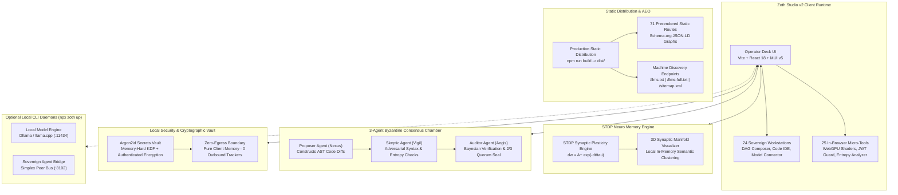

# Zoth Studio v2

> **Zero-Egress Sovereign Agent Development Studio & Tool Matrix**  
> *Client-side WebGPU acceleration, biomorphic STDP memory, 24 sovereign workstations, 25 in-browser micro-tools, 3-agent Byzantine consensus, and Argon2id cryptographic vault.*

[](#zero-egress-security-invariants)
[](#netlify-deployment-instructions)
[](#prerendered-static-routes-71-total)
[](https://vitejs.dev)
[](https://react.dev)
[](https://mui.com)
[](#webgpu--wasm-acceleration)
[](#stdp-neuro-memory--biomorphic-synaptic-persistence)
[](#license)

---

## System Overview & Core Philosophy

**Zoth Studio v2** is a zero-egress, sovereign developer studio designed for orchestrating autonomous AI agent workflows, inspecting code syntax, executing hardware-accelerated WebGPU shaders, and interfacing with local model foundries (such as Ollama or llama.cpp). Built with a gold-on-void aesthetic (`#D4AF37` on `#08080B`), Zoth Studio v2 unifies 24 dedicated workstations and 25 standalone, zero-leakage developer utilities directly in the browser.

- **WHAT THIS IS**: A client-side developer workstation and local tool catalog for coordinating autonomous agent workflows, running WebGPU tensor calculations, visualizing biomorphic STDP synaptic memories, executing 3-agent Byzantine consensus simulations, and connecting to local models on local silicon.
- **WHAT THIS IS NOT**: This is not a cloud SaaS, does not send prompts or telemetry to remote endpoints, and does not require third-party accounts. All primary tools run client-side in the browser, with optional local CLI daemons for IPC and local storage.
- **WINDOWCAROUSEL ARCHITECTURE**: Zoth Studio v2 implements an adaptive `WindowCarousel` architecture across tool suites (WebGen, Memory, Swarms). Operators can glide through full-detail interface cards with generous breathing room or toggle into a clean, stacked single-column view with a single click.

---

## Architectural Topology

### ASCII System Topology

```
+====================================================================================================+
|                                    ZOTH STUDIO v2 OPERATOR WORKSTATION                              |
|                       Client-Side Browser Runtime (React 18 + MUI v5 Gold-on-Void)                  |
+====================================================================================================+
        |                                     |                                     |
        v                                     v                                     v
+-------------------------------+  +-------------------------------+  +-------------------------------+
|       24 WORKSTATIONS         |  |      25 IN-BROWSER TOOLS      |  |      STDP NEURO MEMORY        |
|  - Multi-Agent DAG Composer   |  |  - JWT Inspector Guard        |  |  - Hebbian LTP / LTD Learning |
|  - WebGen Layout Composer     |  |  - Payload Entropy Studio     |  |  - 3D Synaptic Manifold       |
|  - Sovereign Code IDE         |  |  - Polyglot Exporter          |  |  - Exponential Weight Decay   |
|  - Vision Gesture Control     |  |  - MediaPipe Vision Gesture   |  |  - Local Vector Clustering    |
|  - AI Model Connector (Ollama)|  |  - CWV Speed Engine           |  |  - Pure Client Memory State   |
+-------------------------------+  +-------------------------------+  +-------------------------------+
        |                                     |                                     |
        +-------------------------------------+-------------------------------------+
                                              |
        +-------------------------------------+-------------------------------------+
        |                                     |                                     |
        v                                     v                                     v
+-------------------------------+  +-------------------------------+  +-------------------------------+
|  3-AGENT BYZANTINE CONSENSUS  |  |    ARGON2id SECRETS VAULT     |  |     ZERO-EGRESS GUARANTEE     |
|  - Proposer Agent (AST Diff)  |  |  - Client WebCrypto Enclave   |  |  - 100% Client-Side Execution |
|  - Skeptic Agent (Evaluation) |  |  - Memory-Hard Argon2id KDF   |  |  - Zero Cloud Telemetry       |
|  - Auditor Agent (Synthesis)  |  |  - Authenticated AEAD Cipher  |  |  - No Remote Analytics Trackers|
|  - 2/3 Supermajority Seal     |  |  - Local Key Zeroization      |  |  - Air-Gapped Safe            |
+-------------------------------+  +-------------------------------+  +-------------------------------+
        |                                     |                                     |
        v                                     v                                     v
+-------------------------------+  +-------------------------------+  +-------------------------------+
|    OPTIONAL LOCAL DAEMONS     |  |    NETLIFY STATIC HOSTING     |  |   AEO / AX MACHINE DISCOVERY  |
|  - Ollama Engine (:11434)     |  |  - 71 Prerendered Routes      |  |  - /llms.txt & /llms-full.txt |
|  - Neuro Memory Daemon (:8094)|  |  - Instant FCP (< 200ms)      |  |  - /ai.txt Crawler Policy     |
|  - Sovereign Bridge (:8102)   |  |  - Strict CSP & Security      |  |  - /sitemap.xml (71 Entries)  |
|  - Invoked via `npx zoth up`  |  |  - Immutable Asset Caching    |  |  - Schema.org JSON-LD Graphs  |
+-------------------------------+  +-------------------------------+  +-------------------------------+
```

### Mermaid Architecture Topology



---

## 24 Sovereign Studio Workstations

All 24 workstations render natively in Zoth Studio v2 with zero required external dependencies:

| Category | Workstation | Route | Core Function |
| :--- | :--- | :--- | :--- |
| **Agent Coordination** | Multi-Agent DAG Composer | `/workstations/agent-composer` | Visual graph editor for orchestrating agent dependency pipelines |
| **Agent Coordination** | 21-Agent Swarm Radar | `/swarm` | Swarm orchestration, task dispatch, and agent telemetry |
| **Agent Coordination** | Operator Mission Control | `/workstations/mission-control` | Mission status board, active subagents, and thread chronicle |
| **Agent Coordination** | Simplex Signal Bridge | `/bridges` | Sovereign event communication and peer signal matrix |
| **Agent Coordination** | Swarm Bus Monitor | `/workstations/bus-monitor` | Inter-agent event channel inspector and message delivery verification |
| **Memory & Cognitive** | STDP Neuro Memory Hub | `/memory` | 3D synaptic vector manifold and biomorphic persistence console |
| **Memory & Cognitive** | STDP Synaptic Lab | `/memory#lab` | Interactive curve plotter and synaptic weight potentiometer |
| **Consensus & Logic** | Byzantine Consensus Arena | `/consensus` | Triadic dialectic debate arena (Proposer, Skeptic, Auditor) |
| **Consensus & Logic** | Multi-Model Fusion Arena | `/workstations/fusion-arena` | Cross-model AST mutation arbitration and weighted vote tally |
| **Consensus & Logic** | Six Math Pillars Academy | `/docs#sec-math` | Interactive theory academy across Linear Algebra, Calculus, Probability, and STDP |
| **Development & IDE** | Sovereign Code IDE | `/workstations/ide` | Local syntax tree editor, diff review, and invariant linter |
| **Development & IDE** | WebGen Autonomous Foundry | `/webgen` | Standalone HTML/CSS/JS rapid generator and layout composer |
| **Development & IDE** | Edge Forge Micro-Builder | `/workstations/edge-forge` | Sandbox compiler and edge bundle packager |
| **Development & IDE** | Tool Bench Sandbox | `/workstations/tool-bench` | Live test harness for isolated schema-validated agent tools |
| **Development & IDE** | Polyglot Framework Exporter | `/tools/polyglot-framework-exporter` | Transpiles components across React, Vue, Svelte, and Solid |
| **Security & Cryptography** | Adytum Hardware Sanctum | `/adytum` | Meditative cryptographic sanctum with Argon2id memory hardness |
| **Security & Cryptography** | HexStrike Cybersec Arsenal | `/hexstrike` | Air-gapped CVE vulnerability matrix and attack surface analyzer |
| **Security & Cryptography** | Zero-Egress Enclave Desk | `/docs#sec-egress` | Shannon entropy gate, port audit, and privacy invariants |
| **Security & Cryptography** | Zoth OS Hypervisor Sandbox | `/zoth-os` | Virtual machine runner and isolated runtime sandbox guide |
| **Security & Cryptography** | Hardware Vault Console | `/docs#sec-5` | Argon2id key derivation manager and secret seal console |
| **Brand & Creative** | Brand Seals Studio | `/workstations/brand-seals` | Vector seal generation, geometric seals, and badge stampers |
| **Brand & Creative** | Telemetry HUD Cockpit | `/workstations/cyberpunk-hud` | High-density telemetry displays, frequency sweeps, and audio meters |
| **Intelligence & Models** | AI Model Connector | `/workstations/models` | Connectors for local Ollama, llama.cpp, and ONNX Runtime Web |
| **Review & Machine AX** | Agent Experience Powerhouse | `/ax` | Machine-readable AX manifest builder and agent benchmark |

---

## 25 In-Browser Micro-Tools

Air-gapped developer utilities operating with zero network calls:

1. **JWT Inspector Guard** (`/tools/jwt-inspector-guard`): Client-side decoding, signature structure validation, and Shannon entropy analysis on claims.
2. **Payload Shannon Entropy Studio** (`/tools/payload-entropy-studio`): Shannon entropy curve calculation to detect encrypted or obfuscated shell payloads.
3. **Polyglot Framework Exporter** (`/tools/polyglot-framework-exporter`): Transpiles UI templates across React, Svelte, Vue, and vanilla DOM.
4. **CWV Speed Engine** (`/tools/cwv-speed-engine`): In-browser Core Web Vitals analyzer calculating LCP, FID, and CLS bottlenecks.
5. **UFO Sacred Geometry** (`/tools/ufo-sacred-geometry`): Mathematical geometric pattern generator rendering high-precision SVGs.
6. **Badge3D Coin Generator** (`/tools/badge3d-coin-generator`): WebGL metallic medallion and physical token renderer.
7. **Nexus 3D Scene Studio** (`/tools/nexus-3d-scene-studio`): Zero-dependency 3D canvas editor for spatial entity positioning.
8. **Datamosh Glitch Studio** (`/tools/datamosh-glitch-studio`): I-frame removal and compression artifact simulator for digital art.
9. **Subsweep Lead Scanner** (`/tools/subsweep-lead-scanner`): Passive subdomain reconnaissance and attack-surface visualizer.
10. **Omnipost Social Engine** (`/tools/omnipost-social-engine`): Multi-channel markdown syndication formatter with token preview.
11. **OG Canvas Forge** (`/tools/og-canvas-forge`): In-browser dynamic Open Graph banner generation at 1200x630.
12. **PWA Manifest Builder** (`/tools/pwa-manifest-builder`): Complete Web App Manifest JSON generator with asset bundling.
13. **Schema Illustrator Studio** (`/tools/schema-illustrator-studio`): Interactive Schema.org graph builder and validator.
14. **DeepSearch Research Agent** (`/tools/deepsearch-research-agent`): Local document indexer with BM25 keyword matching.
15. **PromptMaster Studio** (`/tools/promptmaster-studio`): Systematic prompt optimizer with token analysis.
16. **Cron Rhythm Studio** (`/tools/cron-rhythm-studio`): Visual crontab expression synthesizer and human-readable timeline.
17. **Regex Droid Builder** (`/tools/regex-droid-builder`): Regular expression visualizer with catastrophic backtracking analysis.
18. **WCAG Contrast Guard** (`/tools/wcag-contrast-guard`): Accessibility color contrast ratio tester complying with WCAG 2.1 AAA.
19. **AudioCipher Stego Engine** (`/tools/audiocipher-stego-engine`): Spectrogram-based acoustic steganography encoder.
20. **Web Security Guard** (`/tools/web-security-guard`): Client-side Content Security Policy (CSP) builder and audit engine.
21. **Cyber Turtle Studio** (`/tools/cyber-turtle-studio`): Recursive geometric logo and procedural vector art generator.
22. **CertPath Roadmap Studio** (`/tools/certpath-roadmap-studio`): Interactive technical skill tree and certification tracker.
23. **Vision Gesture Control** (`/tools/vision-gesture-control`): In-browser computer vision hand-tracking interface.
24. **EnvGuard Secrets Vault** (`/tools/envguard-secrets-vault`): Local memory-hard credential store and environment sanitizer.
25. **Vector Search Engine** (`/tools/vector-search-engine`): In-browser cosine similarity and Euclidean distance vector ranker.

---

## STDP Neuro Memory & Biomorphic Synaptic Persistence

Governed by **Spike-Timing-Dependent Plasticity (STDP)**, the Neuro Memory engine (`/memory`) models biological Hebbian learning so verified architectural decisions remain potentiated while transient noise naturally decays:

### Mathematical Formulation

$$\Delta w = \begin{cases} A_+ \exp\left(-\frac{\Delta t}{\tau_+}\right), & \Delta t > 0 \quad (\text{Long-Term Potentiation: Pre before Post}) \\ -A_- \exp\left(\frac{\Delta t}{\tau_-}\right), & \Delta t < 0 \quad (\text{Long-Term Depression: Post before Pre}) \end{cases}$$

Where:
- $\Delta t = t_{\text{post}} - t_{\text{pre}}$: Temporal gap between memory activation and invariant verification.
- $A_+ = 1.0$: Maximum potentiation amplitude for verified consensus decisions.
- $A_- = 0.85$: Depression amplitude for unverified or abandoned execution paths.
- $\tau_+ = 20\text{ ms}$: Potentiation decay time constant.
- $\tau_- = 20\text{ ms}$: Depression decay time constant.
- $w \in [0.1, 1.0]$: Clamped synaptic weight range.

```
Potentiation (+Δw)
       ^
   1.0 |    *
       |     *
       |       *
   0.0 +---------*-------------------> Δt (ms)
       |          *
       |            *
  -0.85|              *
       v
Depression (-Δw)
```

Synaptic vectors are projected onto an interactive 3D scatter manifold with semantic clustering, allowing developers to explore agent memory graphs without external vector databases.

---

## 3-Agent Byzantine Consensus Chamber

Before modifying project code, staging commits, or mutating schemas, Zoth Studio can simulate a **Triadic Byzantine Consensus Protocol** (`/consensus`):

```
+------------------+       +-------------------+       +------------------+
|  Proposer Agent  | ----> |   Skeptic Agent   | ----> |  Auditor Agent   |
| (AST Mutation)   |       | (Adversarial Check|       | (Verdict Seal)   |
+------------------+       +-------------------+       +------------------+
        |                           |                           |
        +---------------------------+---------------------------+
                                    |
                                    v
                     2/3 Byzantine Supermajority Ratification
```

1. **Proposer Agent (Nexus)**: Constructs minimal surgical AST mutations and presents the semantic delta.
2. **Skeptic Agent (Vigil)**: Analyzes the AST diff for breaking changes, race conditions, and anomalous entropy deltas.
3. **Auditor Agent (Aegis)**: Evaluates the dialectic via Bayesian confidence scoring, verifying compliance with Zero-Egress invariants before issuing a ratification verdict.

---

## WebGPU & WASM Acceleration

Zoth Studio v2 harnesses client hardware acceleration directly in the browser:

1. **WebGPU WGSL Pipelines**: Executes parallel compute shaders across GPU workgroups (8×8 or 16×16 threads) for microsecond-tier tensor matrix multiplications ($C = A \times B$) and vector similarity searches.
2. **WASM SIMD 128-bit Fallback**: When WebGPU is not supported by the platform, computation automatically shifts to WebAssembly compiled with 128-bit SIMD vector instructions running across multi-threaded Web Workers.
3. **Deterministic Outputs**: All acceleration tiers produce bit-identical deterministic outputs, ensuring reliable offline capability across modern browsers and legacy hardware.

---

## Zero-Egress Security Invariants

Zoth Studio enforces the strict **OWASP Zero-Egress Invariants**:

1. **Client-Side Isolation**: All core tool logic, cryptographic hashing, and tensor compute runs 100% in client browser memory.
2. **Zero Cloud Telemetry & Tracking**: Zero third-party analytics SDKs (no Google Analytics, Mixpanel, Segment, or PostHog). Zero remote error beacons.
3. **Shannon Entropy Gating**: Payloads are scanned for anomalous entropy thresholds ($H(X) > 7.2$ bits/byte) to detect obfuscated shell payloads and credential leakage.
4. **Code Execution Safeguards**: Absolute prohibition against `eval()`, `new Function()`, and `document.write()`. Strict defenses against prototype pollution and unescaped HTML injection.
5. **Local Data Persistence**: State is stored strictly in client storage (IndexedDB, Web Crypto keys, local storage) with zero external cloud sync.

---

## Netlify Deployment Instructions

Zoth Studio v2 compiles into a high-performance static distribution ready for Netlify or any static web host:

### Build Commands

```bash
# Clean install dependencies
npm ci

# Production build: compiles Vite bundle and triggers static prerender engine
npm run build
```

The build script executes:
```bash
vite build && node scripts/prerender.mjs
```

### Netlify Configuration (`netlify.toml`)

- **Publish Directory**: `dist`
- **Node Version**: `20`
- **SPA Fallback**:
  ```toml
  [[redirects]]
    from = "/*"
    to = "/index.html"
    status = 200
  ```
- **Security & Caching Headers**:
  - `X-Frame-Options: SAMEORIGIN` + strict `Content-Security-Policy`.
  - `X-Content-Type-Options: nosniff`, `Referrer-Policy: strict-origin-when-cross-origin`, and `Permissions-Policy`.
  - Immutable 1-year caching for static `/assets/*` and `/brand/*`.
  - Open headers (`Access-Control-Allow-Origin: *`) for machine discovery endpoints (`/llms.txt`, `/ai.txt`, `/sitemap.xml`).

### Prerendered Static Routes (71 Total)

During `npm run build`, `scripts/prerender.mjs` prerenders **71 static HTML routes** into `dist/`, including:
- **Core Hub & Pages**: `/`, `/docs`, `/memory`, `/swarm`, `/bridges`, `/consensus`, `/hexstrike`, `/zoth-os`, `/webgen`, `/adytum`, `/faqs`, `/ax`, `/workstations`, `/tools`, `/templates`
- **24 Workstation Detail Routes**: `/workstations/agent-composer`, `/workstations/brand-seals`, `/workstations/cyberpunk-hud`, etc.
- **25 In-Browser Tool Routes**: `/tools/jwt-inspector-guard`, `/tools/payload-entropy-studio`, `/tools/polyglot-framework-exporter`, etc.
- **6 Math Pillar Pages**: `/docs/math/linear`, `/docs/math/calculus`, `/docs/math/probability`, `/docs/math/hessian`, `/docs/math/lyapunov`, `/docs/math/stdp`
- **Static Template Routes**: Scaffolding starter templates.

Every prerendered route includes:
- Unique, keyword-optimized `<title>` and `<meta name="description">` tags.
- Open Graph (`og:*`) and Twitter Card metadata.
- Fully hydrated Schema.org JSON-LD `@graph` (`WebSite`, `Organization`, `SoftwareApplication`, `FAQPage`).
- Semantic `<noscript>` HTML fallback shells for search crawlers and answer engines.

---

## Machine-Readable Discovery Endpoints

Zoth Studio implements state-of-the-art Answer Engine Optimization (AEO) and Agent Experience (AX) protocols:

| Endpoint | Content Type | Purpose & Target Consumer |
| :--- | :--- | :--- |
| **`/llms.txt`** | `text/plain; charset=UTF-8` | Condensed markdown system overview (< 5 KB) for LLM agents, ChatGPT, Claude, and Perplexity |
| **`/llms-full.txt`** | `text/plain; charset=UTF-8` | Comprehensive system architecture manual, schema specs, and protocols for deep analysis |
| **`/ai.txt`** | `text/plain; charset=UTF-8` | Autonomous crawler policy granting grounding, indexing, and attribution rights to AI bots |
| **`/sitemap.xml`** | `application/xml; charset=UTF-8`| Synchronized XML sitemap covering all 71 static routes with priorities and update timestamps |
| **`/robots.txt`** | `text/plain; charset=UTF-8` | Crawler permissions explicitly welcoming search and AI crawlers |
| **`/api/ax/manifest.json`** | `application/json; charset=UTF-8`| Machine-readable AX manifest for programmatic agent discovery and tool binding |

---

## Quick Start & CLI Reference

### 1. Prerequisites
- **Node.js**: `>= 20.0.0`
- **Optional**: Local Ollama or llama.cpp for on-device LLM inference (`ollama serve` on port 11434).

### 2. Local Setup
```bash
# Clone or enter repository
cd zoth-studio-v2

# Install dependencies
npm install

# Start Vite development server
npm run dev
```

Visit the local development URL (typically `http://localhost:5173` or `http://localhost:3000`) in your browser.

### 3. Zoth CLI (`npx zoth`)

The `zoth` CLI (`bin/zoth.js`, executable via `npx zoth` or `npm run zoth -- <command>`) provides developer orchestration:

| Command | Action |
| :--- | :--- |
| `npx zoth status` | Probe local environment readiness, hardware acceleration, and tool repos |
| `npx zoth list` | Catalog all 25 sovereign micro-tools with their open-source URLs |
| `npx zoth pull <tool>` | Clone or fast-forward a standalone micro-tool into `./tools/<tool>` |
| `npx zoth pull --all` | Clone all 25 published tools into `./tools` |
| `npx zoth up` | Initialize local daemons and offline caches |
| `npx zoth down` | Stop local background processes |
| `npx zoth doctor` | Verify local dependencies and environment integrity |

### 4. Production Build & Verify
```bash
# Compile bundle and prerender all 71 static routes
npm run build

# Preview production build locally
npm run preview
```

---

## Project Structure

```
zoth-studio-v2/
├── bin/
│   └── zoth.js                 # Zoth Studio CLI (status, list, pull, up, down, doctor)
├── backend/                    # Optional local daemons and service harnesses
│   ├── neuro-memory-daemon/    # Python STDP biomorphic memory service
│   ├── sovereign-agent-bridge/ # Inter-agent IPC service
│   └── vault-daemon/           # Argon2id + authenticated encryption vault
├── docs/                       # Architectural documentation & AEO specs
│   ├── ARCHITECTURE.md         # System blueprint and security model
│   ├── AEO_AX_SPECIFICATION.md # Agent Experience & AI crawler protocols
│   └── NETLIFY_DEPLOYMENT_AEO.md# Netlify deployment and route prerender guide
├── public/                     # Static assets served at root
│   ├── assets/                 # Brand visuals and graphics
│   ├── brand/                  # Vector logos and GhostByte seals
│   ├── fonts/                  # Celtic Garamond and monospace typography
│   ├── llms.txt                # Standardized AI answer engine summary
│   ├── llms-full.txt           # Exhaustive machine-readable system manual
│   ├── ai.txt                  # Autonomous AI crawler policy
│   ├── robots.txt              # Crawler permissions
│   └── sitemap.xml             # 71-route search engine index
├── scripts/
│   └── prerender.mjs           # Prerender engine for 71 static HTML routes
├── src/
│   ├── components/             # Reusable UI components (CinematicIntro, Navbar, Footer, etc.)
│   ├── config/
│   │   └── site.js             # Central SEO/AEO metadata & Schema.org generators
│   ├── data/                   # Workstations, 25 tools, ASCII banners, and FAQs data
│   ├── pages/                  # React page views (HomePage, FaqsPage, MemoryPage, etc.)
│   ├── theme.js                # Dual light/dark gold-on-void MUI theme
│   ├── App.jsx                 # Central router & AppShell
│   └── main.jsx                # React root entry point
├── index.html                  # HTML entry point with Schema.org JSON-LD
├── netlify.toml                # Netlify production configuration
├── package.json                # Project manifest and scripts
└── vite.config.js              # Vite configuration
```

---

## Contributing

Zoth Studio v2 is a sovereign, local-first project. Contributions are welcome within the zero-egress philosophy:

1. **Fork & branch** — work on a feature branch off `main`.
2. **Keep it local-first** — no new cloud telemetry, analytics SDKs, or third-party auth. New tools must run client-side in the browser or on local daemons.
3. **Respect the invariants** — no `eval()`, `new Function()`, or `document.write()`; no wildcard network exposure; no prototype pollution.
4. **Register new tools** — add entries to `src/data/toolsData.js` and register corresponding routes in `scripts/prerender.mjs`.
5. **Verify before opening a PR** — run `npm run build` and ensure all routes prerender cleanly.

---

## License

Copyright © 2026 NullAI Tech. All rights reserved.  
Licensed under the **Sovereign Developer License** (Zero-Egress Guaranteed).
