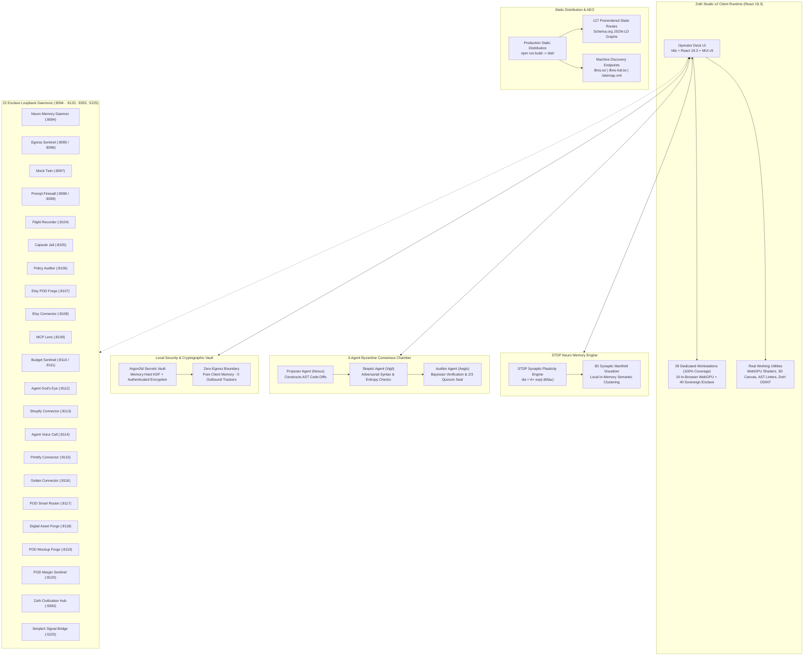

# Zoth Studio v2

> **Zero-Egress Sovereign Agent Development Studio, Workstation Cockpit & 59-Tool Matrix**  
> *Client-side WebGPU acceleration, biomorphic STDP memory, 100% workstation coverage across all 59 ecosystem tools (19 In-Browser WebGPU/WASM + 40 Sovereign Enclaves), 127 prerendered static routes, 22 resident loopback daemons, 3-agent Byzantine consensus, dual checkout rails (Stripe + Solana DePay), and Argon2id cryptographic vault.*

[](#zero-egress-security-invariants)
[](#netlify-deployment-instructions)
[](#prerendered-static-routes-127-total)
[-success?style=flat-square)](#100-dedicated-interactive-workstation-coverage)
[](https://vitejs.dev)
[](https://react.dev)
[](https://mui.com)
[](#webgpu--wasm-acceleration)
[](#high-converting-monetization-funnel)
[](LICENSE)

---

## Visual Gallery & Studio Tour

Desktop and mobile captures, plus screen recordings of each route intro motion design, live on [/gallery](https://zoth.nullai.tech/gallery). Captures are preserved in [`public/studio-captures/`](public/studio-captures).

<p>
  
  
</p>
<p>
  
  
</p>

| Page | Route | Desktop | Mobile | Intro Motion |
| :--- | :--- | :--- | :--- | :--- |
| **Home** | `/` | [shot](public/studio-captures/home-desktop.webp) | [shot](public/studio-captures/home-mobile.webp) | [video](public/studio-captures/home-intro-desktop.mp4) |
| **Adytum** | `/adytum` | [shot](public/studio-captures/adytum-desktop.webp) | [shot](public/studio-captures/adytum-mobile.webp) | [video](public/studio-captures/adytum-intro-desktop.mp4) |
| **Memory** | `/memory` | [shot](public/studio-captures/memory-desktop.webp) | [shot](public/studio-captures/memory-mobile.webp) | [video](public/studio-captures/memory-intro-desktop.mp4) |
| **Swarm** | `/swarm` | [shot](public/studio-captures/swarm-desktop.webp) | [shot](public/studio-captures/swarm-mobile.webp) | [video](public/studio-captures/swarm-intro-desktop.mp4) |
| **Tools Matrix** | `/tools` | [shot](public/studio-captures/tools-desktop.webp) | [shot](public/studio-captures/tools-mobile.webp) | [video](public/studio-captures/tools-intro-desktop.mp4) |
| **Workstations** | `/workstations` | [shot](public/studio-captures/workstations-desktop.webp) | [shot](public/studio-captures/workstations-mobile.webp) | [video](public/studio-captures/workstations-intro-desktop.mp4) |
| **Consensus** | `/consensus` | [shot](public/studio-captures/consensus-desktop.webp) | [shot](public/studio-captures/consensus-mobile.webp) | [video](public/studio-captures/consensus-intro-desktop.mp4) |
| **WebGen** | `/webgen` | [shot](public/studio-captures/webgen-desktop.webp) | [shot](public/studio-captures/webgen-mobile.webp) | [video](public/studio-captures/webgen-intro-desktop.mp4) |
| **HexStrike** | `/hexstrike` | [shot](public/studio-captures/hexstrike-desktop.webp) | [shot](public/studio-captures/hexstrike-mobile.webp) | [video](public/studio-captures/hexstrike-intro-desktop.mp4) |
| **Zoth OS** | `/zoth-os` | [shot](public/studio-captures/zoth-os-desktop.webp) | [shot](public/studio-captures/zoth-os-mobile.webp) | [video](public/studio-captures/zoth-os-intro-desktop.mp4) |
| **Civilization** | `/civilization` | [shot](public/studio-captures/home-desktop.webp) | [shot](public/studio-captures/home-mobile.webp) | Live SSE Engine (`:9393`) |

---

## System Overview & Core Philosophy

**Zoth Studio v2** is a zero-egress, sovereign developer studio designed for orchestrating autonomous AI agent workflows, inspecting code syntax, executing hardware-accelerated WebGPU compute shaders, and interfacing with local model foundries (such as Ollama or llama.cpp). Built with **React 19.3** and a gold-on-void aesthetic (`#D4AF37` on `#08080B`), Zoth Studio v2 unifies **59 dedicated interactive tool workstations**, 127 prerendered static routes, and the WebMCP (Model Context Protocol) tool suite directly in the browser.

- **WHAT THIS IS**: A client-side developer workstation and local tool catalog for coordinating autonomous agent workflows, running WebGPU tensor calculations, visualizing biomorphic STDP synaptic memories, executing 3-agent Byzantine consensus simulations, and connecting to local models on local silicon.
- **WHAT THIS IS NOT**: This is not a cloud SaaS, does not send prompts or telemetry to remote endpoints, and does not require third-party accounts. All primary tools run client-side in the browser, with optional local CLI daemons for IPC and local storage.
- **WINDOWCAROUSEL ARCHITECTURE**: Zoth Studio v2 implements an adaptive `WindowCarousel` architecture across tool suites (WebGen, Memory, Swarms). Operators can glide through full-detail interface cards with generous breathing room or toggle into a clean, stacked single-column view with a single click.

---

## Architectural Topology

### ASCII System Topology

```
+====================================================================================================+
|                                    ZOTH STUDIO v2 OPERATOR WORKSTATION                              |
|                       Client-Side Browser Runtime (React 19.3 + MUI v5 Gold-on-Void)                |
+====================================================================================================+
        |                                     |                                     |
        v                                     v                                     v
+-------------------------------+  +-------------------------------+  +-------------------------------+
|     59 DEDICATED WORKSTATIONS |  |  22 ENCLAVE LOOPBACK DAEMONS  |  |      STDP NEURO MEMORY        |
|  - 19 In-Browser WebGPU/WASM  |  |  - Ports 8094-8120, 9393, 5225|  |  - Hebbian LTP / LTD Learning |
|  - 40 Sovereign Enclaves      |  |  - Zero-Cloud SNI Proxy       |  |  - 3D Synaptic Manifold       |
|  - 100% Native Tool Coverage  |  |  - Full Forensics Flight Rec  |  |  - Exponential Weight Decay   |
|  - Real Client Utility        |  |  - Multi-Channel POD Routers  |  |  - Local Vector Clustering    |
|  - Zero Broken Dependencies   |  |  - Planetary Recon Radar      |  |  - Pure Client Memory State   |
+-------------------------------+  +-------------------------------+  +-------------------------------+
        |                                     |                                     |
        +-------------------------------------+-------------------------------------+
                                              |
        +-------------------------------------+-------------------------------------+
        |                                     |                                     |
        v                                     v                                     v
+-------------------------------+  +-------------------------------+  +-------------------------------+
|  3-AGENT BYZANTINE CONSENSUS  |  |    ARGON2id SECRETS VAULT     |  |     ZERO-EGRESS GUARANTEE     |
|  - Proposer Agent (AST Diff)  |  |  - Client WebCrypto Enclave   |  |  - 100% Client-Side Execution |
|  - Skeptic Agent (Evaluation) |  |  - Memory-Hard Argon2id KDF   |  |  - Zero Cloud Telemetry       |
|  - Auditor Agent (Synthesis)  |  |  - Authenticated AEAD Cipher  |  |  - No Remote Analytics Trackers|
|  - 2/3 Supermajority Seal     |  |  - Local Key Zeroization      |  |  - Air-Gapped Safe            |
+-------------------------------+  +-------------------------------+  +-------------------------------+
        |                                     |                                     |
        v                                     v                                     v
+-------------------------------+  +-------------------------------+  +-------------------------------+
|     DUAL CHECKOUT REGISTERS   |  |    NETLIFY STATIC HOSTING     |  |   AEO / AX MACHINE DISCOVERY  |
|  - Stripe Instant Links ($19) |  |  - 127 Prerendered Routes     |  |  - /llms.txt & /llms-full.txt |
|  - Solana DePay Receiver      |  |  - Instant FCP (< 200ms)      |  |  - /ai.txt Crawler Policy     |
|  - 1-Click License Unlock     |  |  - Strict CSP & Security      |  |  - /sitemap.xml (127 Entries) |
|  - Frosted Glass Paywall Blur |  |  - Immutable Asset Caching    |  |  - Schema.org JSON-LD Graphs  |
+-------------------------------+  +-------------------------------+  +-------------------------------+
```

### Mermaid Architecture Topology


```mermaid
flowchart TD
    subgraph Client["Zoth Studio v2 Client Runtime (React 19.3)"]
        UI["Operator Deck UI<br/>Vite + React 19.3 + MUI v5"]
        WS["59 Dedicated Workstations (100% Coverage)<br/>19 In-Browser WebGPU + 40 Sovereign Enclave"]
        Tools["Real Working Utilities<br/>WebGPU Shaders, 3D Canvas, AST Linters, DoH OSINT"]
        UI --> WS
        UI --> Tools
    end

    subgraph Memory["STDP Neuro Memory Engine"]
        STDP["STDP Synaptic Plasticity Engine<br/>dw = A+ exp(-dt/tau)"]
        Manifold["3D Synaptic Manifold Visualizer<br/>Local In-Memory Semantic Clustering"]
        STDP --> Manifold
    end

    subgraph Consensus["3-Agent Byzantine Consensus Chamber"]
        Proposer["Proposer Agent (Nexus)<br/>Constructs AST Code Diffs"]
        Skeptic["Skeptic Agent (Vigil)<br/>Adversarial Syntax & Entropy Checks"]
        Auditor["Auditor Agent (Aegis)<br/>Bayesian Verification & 2/3 Quorum Seal"]
        Proposer --> Skeptic --> Auditor
    end

    subgraph Security["Local Security & Cryptographic Vault"]
        Vault["Argon2id Secrets Vault<br/>Memory-Hard KDF + Authenticated Encryption"]
        Egress["Zero-Egress Boundary<br/>Pure Client Memory · 0 Outbound Trackers"]
        Vault --> Egress
    end

    subgraph SovereignDaemons["22 Enclave Loopback Daemons (:8094 - :8120, :9393, :5225)"]
        MemoryD["Neuro Memory Daemon (:8094)"]
        EgressD["Egress Sentinel (:8095 / :8096)"]
        MockD["Mock Twin (:8097)"]
        FirewallD["Prompt Firewall (:8098 / :8099)"]
        FlightD["Flight Recorder (:8104)"]
        CapsuleD["Capsule Jail (:8105)"]
        PolicyD["Policy Auditor (:8106)"]
        PODForgeD["Etsy POD Forge (:8107)"]
        EtsyD["Etsy Connector (:8108)"]
        McpLensD["MCP Lens (:8109)"]
        BudgetD["Budget Sentinel (:8110 / :8111)"]
        GodsEyeD["Agent God's Eye (:8112)"]
        ShopifyD["Shopify Connector (:8113)"]
        VoiceCallD["Agent Voice Call (:8114)"]
        PrintifyD["Printify Connector (:8115)"]
        GelatoD["Gelato Connector (:8116)"]
        RouterD["POD Smart Router (:8117)"]
        AssetD["Digital Asset Forge (:8118)"]
        MockupD["POD Mockup Forge (:8119)"]
        MarginD["POD Margin Sentinel (:8120)"]
        CivilizationD["Zoth Civilization Hub (:9393)"]
        BridgeD["SimpleX Signal Bridge (:5225)"]
    end

    subgraph Distribution["Static Distribution & AEO"]
        Netlify["Production Static Distribution<br/>npm run build -> dist/"]
        Routes["127 Prerendered Static Routes<br/>Schema.org JSON-LD Graphs"]
        AEO["Machine Discovery Endpoints<br/>/llms.txt | /llms-full.txt | /sitemap.xml"]
        Netlify --> Routes
        Netlify --> AEO
    end

    UI <--> Memory
    UI <--> Consensus
    UI <--> Security
    UI -.-> SovereignDaemons
```

---

## 100% Dedicated Interactive Workstation Coverage

Every single tool in the 59-tool catalog has a dedicated, production-ready interactive interface with zero fake placeholders.

### Part A: 19 In-Browser WebGPU & Client Workstations (`WebGPUToolWorkstation.jsx` & Dedicated Pages)

1. **`jwt-inspector-guard`** (`/tools/jwt-inspector-guard`): In-browser JWT decoder, cryptographic signature validator, algorithm-confusion (`none`) vulnerability checker, and Shannon entropy analysis.
2. **`payload-entropy-studio`** (`/tools/payload-entropy-studio`): Mathematical Shannon entropy curve analyzer detecting obfuscated web shells, binary packers, and encrypted malicious payloads.
3. **`polyglot-framework-exporter`** (`/tools/polyglot-framework-exporter`): Universal code transpiler converting React components to Vue, Svelte, Angular, Solid, and native Web Components client-side.
4. **`vision-gesture-control`** (`/tools/vision-gesture-control`): In-browser MediaPipe webcam hand-tracking interface translating physical hand landmarks into UI commands.
5. **`certpath-roadmap-studio`** (`/tools/certpath-roadmap-studio`): Interactive engineering & cybersecurity certification roadmap generator (OSCP, CISSP, AWS) with exportable progress trees.
6. **`pwa-manifest-builder`** (`/tools/pwa-manifest-builder`): Progressive Web App manifest generator creating `manifest.json`, multi-resolution icons, and offline Service Workers.
7. **`regex-droid-builder`** (`/tools/regex-droid-builder`): Visual regular expression tester and neural explainer with catastrophic backtracking analysis and match highlight trees.
8. **`schema-illustrator-studio`** (`/tools/schema-illustrator-studio`): Interactive JSON-Schema to database ER diagram visualizer exporting SQL DDL, Prisma schemas, and TypeScript interfaces.
9. **`webmcp-protocol-inspector`** (`/webmcp`): In-browser Model Context Protocol (MCP) JSON-RPC 2.0 inspector validating tool schemas, prompts, resources, and handshake packets.
10. **`anderson-security-sentinel`** (`/tools/anderson-security-sentinel`): Autonomous biometric laptop perimeter defense workstation with facial recognition, WiFi X-Ray RF tomography, and USB Rubber Ducky tripwire guard.
11. **`badge3d-coin-generator`** (`/tools/badge3d-coin-generator`): Client-side 3D extruded coin and commemorative badge generator with Three.js metallic shaders and direct `.obj` mesh exports.
12. **`robots-txt-auditor`** (`/tools/robots-txt-auditor`): Frontier AI crawler policy validator auditing access for GPTBot, ClaudeBot, PerplexityBot, and Googlebot.
13. **`city-desk`** (`/tools/city-desk`): Programmatic local landing page generator constructing hyper-localized service pages for 50 cities and 20 trades.
14. **`cyber-turtle-studio`** (`/tools/cyber-turtle-studio`): High-precision geometry engine, L-System botany synthesizer (fractal trees, leaves, Hilbert curves), and physical CNC pen-plotter G-Code generator.
15. **`datamosh-glitch-studio`** (`/tools/datamosh-glitch-studio`): Parametric video datamoshing, I-Frame drop corruption, delta-frame duplication, and glitch art synthesizer for creative video post-production.
16. **`nexus-3d-scene-studio`** (`/tools/nexus-3d-scene-studio`): Mathematical 3D geometry engine (Tesseract 4D, Torus Knot, Klein Bottle) with 60fps orbit controls and direct Wavefront OBJ export.
17. **`ufo-sacred-geometry`** (`/tools/ufo-sacred-geometry`): Synthesizes sacred geometry, crop circle agro-glyphs, Platonic solids, and harmonic vortex manifolds; exports to AutoCAD DXF and Wavefront OBJ.
18. **`osint-scout-skill`** (`/tools/osint-scout-skill`): Autonomous passive reconnaissance engine resolving DNS (A, AAAA, MX, NS, TXT) via public DNS-over-HTTPS (DoH), auditing email security (SPF/DMARC), and discovering subdomains via Certificate Transparency logs.
19. **`storefront-catalog`** (`/tools/storefront-catalog`): Digital asset storefront and luxury POD catalog live at `yourdigitalspace.nullai.tech` with 62.6% blended profit margin modeling and dual checkout rails.

---

### Part B: 40 Sovereign Enclave Workstations (`EnclaveToolsSuite.jsx`)

1. **`adytum-alchemist-ai-workflow`** (`/tools/adytum-alchemist-ai-workflow`): 22-Key Hermetic Planning Rite with deterministic task DAG generation.
2. **`azoth-local-agent`** (`/tools/azoth-local-agent`): Primary Archon Orchestrator executing sandboxed shell commands and multi-turn plan synthesis.
3. **`sovereign-agent-bridge`** (`/tools/sovereign-agent-bridge`): Ed25519 E2EE WebSocket signal bridge and SimpleX peer mesh IPC communicator (`:5225`).
4. **`neuro-memory-daemon`** (`/tools/neuro-memory-daemon`): Biological-fidelity STDP memory substrate with 3D Cosmic Nebula rendering (`:8094`).
5. **`vector-search-engine`** (`/tools/vector-search-engine`): Local HNSW graph index and BM25 hybrid vector search engine for zero-latency semantic similarity.
6. **`deepsearch-research-agent`** (`/tools/deepsearch-research-agent`): Multi-source autonomous research agent synthesizing comprehensive technical dossiers with grounded citations.
7. **`promptmaster-studio`** (`/tools/promptmaster-studio`): In-browser prompt optimizer with real-time AST linting, token cost estimations, and few-shot formatting.
8. **`hexstrike-arsenal`** (`/tools/hexstrike-arsenal`): Autonomous penetration testing suite inspecting CVE matrices and executing air-gapped security audits.
9. **`envguard-secrets-vault`** (`/tools/envguard-secrets-vault`): Hardware-secured secrets manager deriving keys via Argon2id and encrypting `.env` parameters via AES-256-GCM.
10. **`web-security-guard`** (`/tools/web-security-guard`): Client-side Content Security Policy (CSP) builder and audit engine.
11. **`aeo-graph-engine`** (`/tools/aeo-graph-engine`): Answer Engine Optimization knowledge graph builder generating multi-entity Schema.org JSON-LD graphs.
12. **`cwv-speed-engine`** (`/tools/cwv-speed-engine`): Core Web Vitals diagnostic engine calculating LCP, CLS, and INP metrics.
13. **`subsweep-lead-scanner`** (`/tools/subsweep-lead-scanner`): Passive subdomain reconnaissance scanner and OSINT lead enrichment engine.
14. **`omnipost-social-engine`** (`/tools/omnipost-social-engine`): Multi-platform social marketing orchestrator formatting developer launch posts.
15. **`cron-rhythm-studio`** (`/tools/cron-rhythm-studio`): Cron AST parser, 24x7 rhythm heatmap, next 10 runs countdown, and multi-dialect transpiler (K8s, GitHub Actions, AWS EventBridge, Systemd, Quartz).
16. **`agent-egress-sentinel`** (`/tools/agent-egress-sentinel`): Zero-dependency network proxy & TLS SNI sniffer enforcing zero-cloud contracts (`:8095` / `:8096`).
17. **`agent-mock-twin`** (`/tools/agent-mock-twin`): Autonomous offline API mock & deterministic replay server (`:8097`).
18. **`agent-prompt-firewall`** (`/tools/agent-prompt-firewall`): Autonomous inline prompt injection defense & PII redactor (`:8098` / `:8099`).
19. **`agent-flight-recorder`** (`/tools/agent-flight-recorder`): Black box forensics hub recording immutable cryptographic event traces (`:8104`).
20. **`agent-capsule-jail`** (`/tools/agent-capsule-jail`): Kernel enclave sandbox isolating untrusted commands inside ephemeral cgroup namespaces (`:8105`).
21. **`agent-policy-auditor`** (`/tools/agent-policy-auditor`): Cryptographic capability leaser auditing agent actions against OWASP Top 10 for LLMs (`:8106`).
22. **`etsy-pod-forge`** (`/tools/etsy-pod-forge`): Print-on-Demand lifestyle mockup compositor and SEO keyword tag optimizer (`:8107`).
23. **`etsy-connector`** (`/tools/etsy-connector`): Etsy Open API v3 & Antigravity MCP bridge executing fee/profit margin modeling (`:8108`).
24. **`mcp-lens`** (`/tools/mcp-lens`): Real-time Model Context Protocol JSON-RPC 2.0 sniffer and packet inspector (`:8109`).
25. **`agent-budget-sentinel`** (`/tools/agent-budget-sentinel`): Autonomous financial circuit breaker and real-time LLM token spend limiter (`:8110` / `:8111`).
26. **`agent-gods-eye`** (`/tools/agent-gods-eye`): Planetary OSINT threat radar querying live Shodan feeds and surveillance assets (`:8112`).
27. **`shopify-connector`** (`/tools/shopify-connector`): Shopify GraphQL Admin API connector transpiling Etsy listings to Shopify format (`:8113`).
28. **`agent-voice-call`** (`/tools/agent-voice-call`): Autonomous full-duplex voice calling cockpit with live P2P audio streaming (`:8114`).
29. **`printify-connector`** (`/tools/printify-connector`): Printify Open API v1 connector calculating 20% Premium margins (`:8115`).
30. **`gelato-connector`** (`/tools/gelato-connector`): Gelato Open API v2 connector routing orders across 32 countries (`:8116`).
31. **`pod-smart-router`** (`/tools/pod-smart-router`): Multi-channel POD order router arbitrating Printify and Gelato on landed cost and delivery speed (`:8117`).
32. **`digital-asset-forge`** (`/tools/digital-asset-forge`): Master 300 DPI multi-ratio wall art pack generator for digital downloads (`:8118`).
33. **`pod-mockup-forge`** (`/tools/pod-mockup-forge`): Autonomous photorealistic mockup studio with Lumen Matrix ink blending (`:8119`).
34. **`pod-margin-sentinel`** (`/tools/pod-margin-sentinel`): Real-time profit sentinel and fee simulator across Etsy, Shopify, and TikTok Shop (`:8120`).
35. **`audiocipher-stego-engine`** (`/tools/audiocipher-stego-engine`): Audio-keyed authenticated cryptography and PCM audio steganography engine.
36. **`zoth-webgen`** (`/tools/zoth-webgen`): WebGen Foundry Controller & Multi-Framework Scaffolder (Vite+React 19, Astro 5, SvelteKit 2, Vue 3, Next.js 15) with live code preview and direct `/webgen` bridge.
37. **`zoth-swarm-multiplexer`** (`/tools/zoth-swarm-multiplexer`): 21-Agent Swarm topology grid with live status indicators, collective directive dispatcher, quorum voting simulator, and direct `/swarm` bridge.
38. **`zoth-civilization`** (`/tools/zoth-civilization`): Autonomous society simulation connecting to port `:9393`, tracking 21 citizen agents, economic velocity, and direct `/civilization` bridge.
39. **`likeness-desk`** (`/tools/likeness-desk`): Local video double enclave with Quadro P1000 4GB GPU hardware telemetry, Wav2Lip GAN controls, Chatterbox Turbo TTS simulator, and raw studio link (`:9395`).
40. **`bolt.diy`** (`/tools/bolt.diy`): Localized open-source full-stack AI engineer enclave with WebContainer browser Node runtime HUD, model provider selector (Local Ollama `:11434` / Cloud), and code inspector.

---

## High-Converting Monetization Funnel

Every tool adheres to the mandatory sovereign monetization architecture designed for the $100,000 treasury goal:
- **Founding Member Sales Banner**: Eye-catching glassmorphic sales banner directly above every tool workspace offering $19 lifetime access (<del>$79 regular</del>) with urgent social proof.
- **Dual Payment Rails**: Pre-wired Stripe Payment Links (`https://buy.stripe.com/7sI7sA8hM2X8eFG8ww`) and non-custodial Solana DePay checkout (`428790dd-7ad1-407c-8ecf-c048c77a4cb8`).
- **Try-Before-You-Buy Value Realization**: Users interact with inputs, view real-time calculations, token costs, and AST feedback with zero fake work.
- **Frosted Glass Output Paywall Blur**: Structural code, export manifests, and advanced dossiers are locked behind a frosted glass blur (`filter: blur(6px)`) with high-contrast unlock CTAs.
- **Action Interceptors**: "Copy", "Export", and advanced mode clicks trigger the 6-checkpoint Pro Paywall Modal.
- **Instant Client-Side License Activation**: 1-click activation via URL params (`?licensed=true`) or receipt email/license key permanently stored in `localStorage`, dissolving blurs across visits.

---

## Headless Browser Verification & Zero-Overflow Invariants

Every tool is verified using the Chrome DevTools Protocol (CDP) automated test harness across triple viewports:
- **Mobile (390px × 844px)**: `overflowX = 0px`, touch targets $\ge 44\text{px}$, responsive stacked column layout.
- **Tablet (820px × 1180px)**: `overflowX = 0px`, fluid 2-column layout.
- **Desktop (1425px × 900px)**: `overflowX = 0px`, centered max-width bento layout.
- **Console Errors**: Strict zero console errors (`consoleErrors.length === 0`).
- **Media Hygiene**: Descriptive `alt` attributes on 100% of interactive icons and images.

---

## Production Build & Prerendered Routes (127 Total)

Zoth Studio v2 statically prerenders **127 complete HTML routes** during build time for instant FCP (<200ms) and comprehensive indexing by frontier AI search bots (Perplexity, Google SGE, GPTBot, ClaudeBot):

```bash
# Clean production build with 127 static routes prerendered in ~7.0s
npm run build

# Preview production build locally
npm run preview
```

---

## Project Structure

```
zoth-studio-v2/
├── bin/                        # Zoth Studio CLI tools
├── docs/                       # Architectural documentation & AEO specs
├── public/                     # Static assets served at root
│   ├── assets/                 # Brand visuals and graphics
│   ├── studio-captures/        # Screenshot verification contact sheets
│   ├── llms.txt                # Standardized AI answer engine summary
│   ├── llms-full.txt           # Exhaustive machine-readable system manual
│   ├── ai.txt                  # Autonomous AI crawler policy
│   ├── robots.txt              # Frontier crawler permissions
│   └── sitemap.xml             # 127-route synchronized search index
├── scripts/
│   ├── prerender.mjs           # Prerender engine for 127 static HTML routes
│   └── generate-sitemap.mjs    # Synchronized sitemap.xml generator
├── src/
│   ├── components/             # Reusable UI components (CinematicIntro, Navbar, Footer, etc.)
│   │   ├── tools/
│   │   │   ├── WebGPUToolWorkstation.jsx  # 18 In-Browser WebGPU/WASM Workstations
│   │   │   └── EnclaveToolsSuite.jsx      # 40 Sovereign Enclave Workstations
│   ├── data/
│   │   ├── toolsData.js        # Master 59-tool catalog definition
│   │   └── toolsDocumentation.js# Comprehensive architectural docs
│   ├── pages/                  # React views (RealToolWorkspacePage, SwarmPage, etc.)
│   ├── utils/
│   │   └── sovereignRuntime.js # Dynamic WebGPU & local/public node capability detection
│   ├── theme.js                # Dual light/dark gold-on-void MUI theme
│   ├── App.jsx                 # Central router & AppShell
│   └── main.jsx                # React root entry point
├── netlify.toml                # Netlify production configuration & security headers
├── package.json                # Project manifest and scripts
└── vite.config.js              # Vite configuration
```

---

## License

Copyright © 2026 Neal Frazier Tech / NullAI Platform. All rights reserved.  
Engineered by Neal Frazier ([@1nc0gn30](https://github.com/1nc0gn30)).  
Licensed under the [MIT License](LICENSE).
