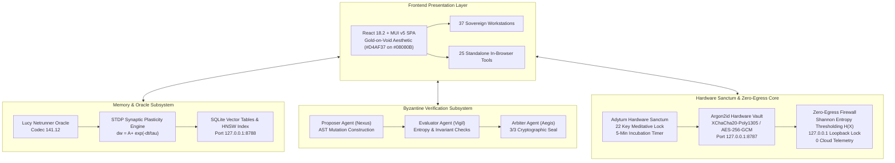

# Zoth Studio v2 Architecture & System Blueprint

## Executive Architectural Summary

**Zoth Studio v2** is a zero-egress, sovereign development studio engineered for local AI agent swarm coordination, biomorphic synaptic memory systems, and cryptographic hardware sanctuaries. It strictly isolates execution to physical host loopback enclaves (`127.0.0.1`), entirely eliminating cloud exfiltration, remote telemetry, and third-party credential dependencies.

```
+====================================================================================================+
|                                    ZOTH STUDIO v2 OPERATOR DESK                                    |
|                         http://127.0.0.1:3000 (React 18 + MUI v5 Gold-on-Void)                     |
+====================================================================================================+
        |                                     |                                     |
        v                                     v                                     v
+-------------------------------+  +-------------------------------+  +-------------------------------+
|       37 WORKSTATIONS         |  |      25 IN-BROWSER TOOLS      |  |    LUCY NETRUNNER ORACLE      |
|  - Multi-Agent DAG Composer   |  |  - JWT Inspector Guard        |  |  - Codec 141.12 Deep Breach   |
|  - Brand Alchemical Seals     |  |  - Payload Entropy Studio     |  |  - STDP Synaptic Plasticity   |
|  - Sovereign Code IDE         |  |  - Polyglot Exporter          |  |  - Whitespace 3D Constellation|
|  - Cyberpunk HUD Cockpit      |  |  - UFO Sacred Geometry        |  |  - SQLite HNSW Vectors        |
|  - AI Model Foundry           |  |  - CWV Speed Engine           |  |  - Port 8788 (Loopback)       |
+-------------------------------+  +-------------------------------+  +-------------------------------+
        |                                     |                                     |
        +-------------------------------------+-------------------------------------+
                                              |
        +-------------------------------------+-------------------------------------+
        |                                     |                                     |
        v                                     v                                     v
+-------------------------------+  +-------------------------------+  +-------------------------------+
|  3-AGENT BYZANTINE CONSENSUS  |  |    ADYTUM HARDWARE SANCTUM    |  |     ZERO-EGRESS GUARANTEE     |
|  - Proposer Agent (AST Diff)  |  |  - 22-Key Cryptographic Gate  |  |  - Loopback Only (127.0.0.1)  |
|  - Evaluator Agent (Entropy)  |  |  - 5-Min Incubation Lock      |  |  - Shannon Entropy Gating     |
|  - Arbiter Agent (Verdict)    |  |  - Argon2id KDF Memory Hard   |  |  - 0 Cloud Telemetry / Beacons|
|  - 3/3 Cryptographic Seal     |  |  - XChaCha20-Poly1305 Vault   |  |  - No eval() / new Function() |
+-------------------------------+  +-------------------------------+  +-------------------------------+
```



---

## 1. Five Core Subsystems

### 1.1 37 Sovereign Workstations
Decoupled and responsive, the 37 workstations provide full operational environments across 7 operational disciplines:
- **Agent Coordination**: Multi-Agent DAG Composer, 21-Agent Pantheon Swarm (`/swarm`), Operator Mission Control, Simplex Signal Bridge (`/bridges`), Swarm Bus Monitor.
- **Memory & Neural**: Lucy Netrunner Memory (`/memory`), STDP Synaptic Lab.
- **Consensus & Logic**: Byzantine Consensus Arena (`/consensus`), Multi-Model Fusion Arena, Six Math Pillars Academy (`/docs#sec-math`).
- **Development & IDE**: Sovereign Code IDE, WebGen Autonomous Foundry (`/webgen`), Edge Forge, Tool Bench, Polyglot Framework Exporter.
- **Security & Sanctum**: Adytum Hardware Sanctum (`/adytum`), HexStrike Cybersec Arsenal (`/hexstrike`), Zero-Egress Enclave Desk, Zoth OS Hypervisor Sandbox (`/zoth-os`), Hardware Vault Console.
- **Brand & Creative**: Brand Alchemical Seals Kit, Cyberpunk HUD Cockpit, Nexus 3D Scene Studio, Badge & Coin Generator, Datamosh Glitch Studio, UFO Sacred Geometry.
- **Web & Automation**: Subsweep Lead Scanner, Omnipost Social Engine, CWV Speed Engine, OG Canvas Forge, PWA Manifest Builder, Schema Illustrator Studio.
- **Intelligence & Models**: AI Model Foundry, DeepSearch Research Agent, PromptMaster Studio, Session Chronicle, Agent Experience Powerhouse (`/ax`).

### 1.2 25 In-Browser Micro-Tools
Zero-network developer utilities built into client-side web workers:
1. `jwt-inspector-guard` - Client-side token header and payload verification.
2. `payload-entropy-studio` - In-browser Shannon entropy calculator and graphing engine.
3. `polyglot-framework-exporter` - Multi-framework component transpiler.
4. `cwv-speed-engine` - Core Web Vitals diagnostic lab.
5. `ufo-sacred-geometry` - Harmonic vector geometry generator.
6. `badge3d-coin-generator` - WebGL 3D coin and badge designer.
7. `nexus-3d-scene-studio` - Air-gapped 3D scene compositor.
8. `datamosh-glitch-studio` - Video glitch and compression artifact simulator.
9. `subsweep-lead-scanner` - Subdomain analysis and asset mapper.
10. `omnipost-social-engine` - Unified social content engine.
11. `og-canvas-forge` - High-resolution OG banner generator.
12. `pwa-manifest-builder` - Progressive Web App config studio.
13. `schema-illustrator-studio` - Schema.org JSON-LD visualizer.
14. `deepsearch-research-agent` - Local BM25 document search.
15. `promptmaster-studio` - Token-optimized prompt editor.
16. `cron-rhythm-studio` - Cron expression simulator and parser.
17. `regex-droid-builder` - Safe regular expression tester.
18. `wcag-contrast-guard` - Accessibility compliance checker.
19. `audiocipher-stego-engine` - Acoustic steganography generator.
20. `web-security-guard` - CSP and HTTP security header builder.
21. `cyber-turtle-studio` - Procedural turtle graphics laboratory.
22. `certpath-roadmap-studio` - Interactive engineering skill trees.
23. `vision-gesture-control` - Local browser gesture recognizer.
24. `envguard-secrets-vault` - In-memory environment sanitizer.
25. `vector-search-engine` - In-browser Euclidean and cosine search.

### 1.3 Lucy Netrunner Oracle & STDP Synaptic Memory
Governed by biomorphic Spike-Timing-Dependent Plasticity (STDP):
$$\Delta w = \begin{cases} A_+ \exp\left(-\frac{\Delta t}{\tau_+}\right), & \Delta t > 0 \quad (\text{LTP}) \\ -A_- \exp\left(\frac{\Delta t}{\tau_-}\right), & \Delta t < 0 \quad (\text{LTD}) \end{cases}$$
- **Lucy Oracle Core**: Codec 141.12 // Deep Net Breach channel providing synthesized voice and telemetry.
- **Whitespace Cyberspace**: 3D spatial constellation partitioned into 6 color-coded memory clusters (Kernel `#D4AF37`, Lucy `#00F0FF`, Consensus `#C084FC`, Security `#F472B6`, Vault `#34D399`, Pantheon `#F59E0B`).

### 1.4 3-Agent Byzantine Consensus Arena
Triadic verification engine requiring unanimous $3/3$ signature approval:
1. **Nexus (Proposer)**: Synthesizes minimal surgical AST mutations.
2. **Vigil (Evaluator)**: Validates semantic AST delta, checks for side-effects, and analyzes entropy.
3. **Aegis (Arbiter)**: Resolves Socratic debate, validates zero-egress invariants, and cryptographically signs the verdict.

### 1.5 Adytum Hardware Sanctum & Argon2id Vault
- **22-Key Meditative Sanctuary**: Master keys gating system configurations.
- **5-Minute Incubation Lock**: Enforces temporal contemplation before key activation, defeating automated brute-force attacks.
- **Argon2id KDF**: Memory hardness set to 64 MB RAM, 3 time iterations, 4 parallelism threads.
- **XChaCha20-Poly1305 Encryption**: Authenticated payload encryption at rest (`~/.zoth/vault.enc`).

---

## 2. Zero-Egress Invariants & Shannon Entropy Gating

All components must satisfy the formal Zero-Egress Security Invariants:
1. **Loopback Binding Guarantee**: All listening ports strictly bound to `127.0.0.1`.
2. **Shannon Entropy Gating**:
   $$H(X) = -\sum_{i=1}^n P(x_i) \log_2 P(x_i)$$
   Payloads exhibiting an entropy score $H(X) > 7.2$ bits/byte are flagged for inspection, preventing obfuscated script delivery and exfiltration of encrypted secrets.
3. **Zero Telemetry**: Absolute absence of third-party telemetry, remote analytics beacons, or external reporting scripts.
4. **Code Execution Integrity**: Prohibition of `eval()`, `new Function()`, dynamic script tag injection, and prototype pollution.

---

## 3. Loopback Enclave Binds

| Service | Bind Address | Protocol | Role |
| :--- | :--- | :--- | :--- |
| **Studio UI** | `127.0.0.1:3000` | HTTP / WS | React 18 + MUI v5 Operator Deck |
| **Neuro Memory Daemon** | `127.0.0.1:8788` | HTTP JSON | STDP synaptic plasticity + SQLite vector tables |
| **Sovereign Agent Bridge**| `127.0.0.1:8789` | WebSocket | 21-Agent Simplex E2EE Noise Protocol IPC bus |
| **Hardware Vault Daemon**| `127.0.0.1:8787` | HTTP JSON | Argon2id KDF + XChaCha20-Poly1305 enclave secrets |
| **Local Model Foundry** | `127.0.0.1:11434` | HTTP JSON | Ollama / llama.cpp on-device LLM inference |
| **Swarm Telemetry Bus** | `127.0.0.1:8989` | WebSocket | Internal consensus telemetry |
| **Operator Deck Port** | `127.0.0.1:8484` | HTTP | Agent execution and fusion IDE console |
| **Public Static Hub** | `127.0.0.1:8088` | HTTP | Legacy static showcase server |

---

## 4. Netlify Deployment & Machine-Readable Discovery

- **Build Pipeline**: `npm run build` runs `vite build && node scripts/prerender.mjs`.
- **83 Prerendered Static Routes**: Static HTML entry points pre-generated with route-specific `<title>`, Open Graph metadata, Schema.org JSON-LD, and `<noscript>` fallbacks.
- **Machine-Readable Discovery Endpoints**:
  - `/llms.txt`: Plain-text markdown fact sheet (< 5 KB) for LLM agents.
  - `/llms-full.txt`: Full architecture and knowledge graph for autonomous reasoning engines.
  - `/ai.txt`: Autonomous crawler policy allowing ethical grounding and indexing.
  - `/sitemap.xml`: Complete inventory of all 83 static routes.
