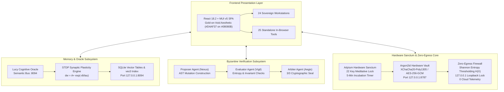

# Zoth Studio v2 Architecture & System Blueprint

## Executive Architectural Summary

**Zoth Studio v2** is a zero-egress, sovereign development studio engineered for local AI agent swarm coordination, biomorphic synaptic memory systems, and cryptographic hardware sanctuaries. It strictly isolates execution to physical host loopback enclaves (`127.0.0.1`), entirely eliminating cloud exfiltration, remote telemetry, and third-party credential dependencies.

```
+====================================================================================================+
|                                    ZOTH STUDIO v2 OPERATOR DESK                                    |
|                         http://127.0.0.1:3000 (React 18 + MUI v5 Gold-on-Void)                     |
+====================================================================================================+
        |                                     |                                     |
        v                                     v                                     v
+-------------------------------+  +-------------------------------+  +-------------------------------+
|       24 WORKSTATIONS         |  |      25 IN-BROWSER TOOLS      |  |    LUCY COGNITIVE ORACLE      |
|  - Multi-Agent DAG Composer   |  |  - JWT Inspector Guard        |  |  - Semantic Bus :8094         |
|  - Brand Alchemical Seals     |  |  - Payload Entropy Studio     |  |  - STDP Synaptic Plasticity   |
|  - Sovereign Code IDE         |  |  - Polyglot Exporter          |  |  - Whitespace 3D Constellation|
|  - Cyberpunk HUD Cockpit      |  |  - MediaPipe Vision Gesture   |  |  - SQLite vec0 Vectors        |
|  - AI Model Foundry           |  |  - CWV Speed Engine           |  |  - Port 8094 (Loopback)       |
+-------------------------------+  +-------------------------------+  +-------------------------------+
        |                                     |                                     |
        +-------------------------------------+-------------------------------------+
                                              |
        +-------------------------------------+-------------------------------------+
        |                                     |                                     |
        v                                     v                                     v
+-------------------------------+  +-------------------------------+  +-------------------------------+
|  3-AGENT BYZANTINE CONSENSUS  |  |    ADYTUM HARDWARE SANCTUM    |  |     ZERO-EGRESS GUARANTEE     |
|  - Proposer Agent (AST Diff)  |  |  - 22-Key Cryptographic Gate  |  |  - Loopback Only (127.0.0.1)  |
|  - Evaluator Agent (Entropy)  |  |  - 5-Min Incubation Lock      |  |  - Shannon Entropy Gating     |
|  - Arbiter Agent (Verdict)    |  |  - Argon2id KDF Memory Hard   |  |  - 0 Cloud Telemetry / Beacons|
|  - 3/3 Cryptographic Seal     |  |  - XChaCha20-Poly1305 Vault   |  |  - No eval() / new Function() |
+-------------------------------+  +-------------------------------+  +-------------------------------+
```



---

## 1. Five Core Subsystems

### 1.1 24 Sovereign Workstations
Decoupled and responsive, the 24 workstations provide full operational environments across 7 operational disciplines:
- **Agent Coordination**: Multi-Agent DAG Composer, 21-Agent Pantheon Swarm (`/swarm`), Operator Mission Control, Simplex Signal Bridge (`/bridges`), Swarm Bus Monitor.
- **Memory & Neural**: Lucy Cognitive Memory (`/memory`), STDP Synaptic Lab.
- **Consensus & Logic**: Byzantine Consensus Arena (`/consensus`), Multi-Model Fusion Arena, Six Math Pillars Academy (`/docs#sec-math`).
- **Development & IDE**: Sovereign Code IDE, WebGen Autonomous Foundry (`/webgen`), Edge Forge, Tool Bench, Polyglot Framework Exporter.
- **Security & Sanctum**: Adytum Hardware Sanctum (`/adytum`), HexStrike Cybersec Arsenal (`/hexstrike`), Zero-Egress Enclave Desk, Zoth OS Hypervisor Sandbox (`/zoth-os`), Hardware Vault Console.
- **Brand & Creative**: Brand Alchemical Seals Kit, Cyberpunk HUD Cockpit, MediaPipe Vision Gesture, Visual Synthesis Matrix.
- **Web & Automation**: Subsweep Lead Scanner, Omnipost Social Engine, CWV Speed Engine, PWA Manifest Builder, Schema Illustrator Studio.
- **Intelligence & Models**: AI Model Foundry, DeepSearch Research Agent, PromptMaster Studio, Session Chronicle, Agent Experience Powerhouse (`/ax`).

### 1.2 25 Authentic Sovereign Micro-Tools
Zero-network developer utilities built for air-gapped security:
1. `adytum-alchemist-ai-workflow` - 22-key hermetic planning rite and incubation gate.
2. `azoth-local-agent` - Archon core orchestrator for local zero-telemetry task dispatching.
3. `sovereign-agent-bridge` - E2EE WebSocket signal protocol and Simplex peer mesh IPC communicator.
4. `neuro-memory-daemon` - STDP biomorphic memory vector engine & cross-session recall on loopback :8094.
5. `vector-search-engine` - Local HNSW vector index engine for fast zero-latency semantic similarity search.
6. `deepsearch-research-agent` - Autonomous multi-source research agent with grounded inline citations.
7. `promptmaster-studio` - System prompt engineering workstation, DSPy prompt optimizer, and template store.
8. `hexstrike-arsenal` - Autonomous penetration audit suite, CVE matrix inspector, and exploit payload lab.
9. `envguard-secrets-vault` - Argon2id + AES-256-GCM hardware vault for zero-cloud secret storage.
10. `jwt-inspector-guard` - In-browser JWT token decoder, cryptographic signature validator, and claim auditor.
11. `payload-entropy-studio` - In-browser Shannon entropy analysis tool for detecting obfuscated payloads.
12. `web-security-guard` - Security headers auditor, CSP validator, and WAF protection scanner.
13. `polyglot-framework-exporter` - In-browser exporter from React/JSX to HTML/CSS, Vue, Svelte, and Solid.js.
14. `aeo-graph-engine` - Answer Engine Optimization knowledge graph builder & Schema.org entity linker.
15. `cwv-speed-engine` - Core Web Vitals LCP, CLS, and INP diagnostic engine & asset minifier.
16. `vision-gesture-control` - In-browser MediaPipe webcam hand-gesture recognition interface controller.
17. `subsweep-lead-scanner` - Subdomain recon scanner and OSINT lead enrichment engine.
18. `omnipost-social-engine` - Multi-platform social content scheduler and cross-post automation engine.
19. `cron-rhythm-studio` - Cron expression rhythm visualizer, scheduler simulator, and trigger matrix.
20. `certpath-roadmap-studio` - Interactive cybersecurity & engineering certification roadmap generator.
21. `pwa-manifest-builder` - Progressive Web App manifest authoring, icon generator, and offline worker builder.
22. `regex-droid-builder` - Visual regular expression tester, neural explainer, and syntax highlighter.
23. `schema-illustrator-studio` - Interactive JSON-Schema to database diagram visualizer and code generator.
24. `zoth-webgen` - Deterministic zero-cloud website generator and layout synthesizer with MCP server.
25. `zoth-swarm-multiplexer` - 21-terminal autonomous agent multiplexer daemon with hot-swappable harnesses.

### 1.3 Lucy Cognitive Oracle & STDP Synaptic Memory
Governed by biomorphic Spike-Timing-Dependent Plasticity (STDP):
$$\Delta w = \begin{cases} A_+ \exp\left(-\frac{\Delta t}{\tau_+}\right), & \Delta t > 0 \quad (\text{LTP}) \\ -A_- \exp\left(\frac{\Delta t}{\tau_-}\right), & \Delta t < 0 \quad (\text{LTD}) \end{cases}$$
- **Lucy Cognitive Oracle**: Semantic Bus `:8094` providing structured zero-egress knowledge retrieval.
- **Whitespace Cyberspace**: 3D spatial constellation partitioned into 6 color-coded memory clusters (Kernel `#D4AF37`, Lucy `#00F0FF`, Consensus `#C084FC`, Security `#F472B6`, Vault `#34D399`, Pantheon `#F59E0B`).

### 1.4 3-Agent Byzantine Consensus Arena
Triadic verification engine requiring unanimous $3/3$ signature approval:
1. **Nexus (Proposer)**: Synthesizes minimal surgical AST mutations.
2. **Vigil (Evaluator)**: Validates semantic AST delta, checks for side-effects, and analyzes entropy.
3. **Aegis (Arbiter)**: Resolves Socratic debate, validates zero-egress invariants, and cryptographically signs the verdict.

### 1.5 Adytum Hardware Sanctum & Argon2id Vault
- **22-Key Meditative Sanctuary**: Master keys gating system configurations.
- **5-Minute Incubation Lock**: Enforces temporal contemplation before key activation, defeating automated brute-force attacks.
- **Argon2id KDF**: Memory hardness set to 64 MB RAM, 3 time iterations, 4 parallelism threads.
- **XChaCha20-Poly1305 Encryption**: Authenticated payload encryption at rest (`~/.zoth/vault.enc`).

---

## 2. Zero-Egress Invariants & Shannon Entropy Gating

All components must satisfy the formal Zero-Egress Security Invariants:
1. **Loopback Binding Guarantee**: All listening ports strictly bound to `127.0.0.1`.
2. **Shannon Entropy Gating**:
   $$H(X) = -\sum_{i=1}^n P(x_i) \log_2 P(x_i)$$
   Payloads exhibiting an entropy score $H(X) > 7.2$ bits/byte are flagged for inspection, preventing obfuscated script delivery and exfiltration of encrypted secrets.
3. **Zero Telemetry**: Absolute absence of third-party telemetry, remote analytics beacons, or external reporting scripts.
4. **Code Execution Integrity**: Prohibition of `eval()`, `new Function()`, dynamic script tag injection, and prototype pollution.

---

## 3. Loopback Enclave Binds

| Service | Bind Address | Protocol | Role |
| :--- | :--- | :--- | :--- |
| **Studio UI** | `127.0.0.1:3000` | HTTP / WS | React 18 + MUI v5 Operator Deck |
| **Neuro Memory Daemon** | `127.0.0.1:8094` | HTTP JSON | STDP synaptic plasticity + SQLite vec0 vector tables |
| **Sovereign Agent Bridge**| `127.0.0.1:8102` | WebSocket | Simplex E2EE Noise Protocol IPC bus |
| **Hardware Vault Daemon**| `127.0.0.1:8787` | HTTP JSON | Argon2id KDF + XChaCha20-Poly1305 enclave secrets |
| **Azoth Archon Daemon** | `127.0.0.1:8790` | HTTP | Local archon agent orchestrator |
| **Swarm Multiplexer** | `127.0.0.1:8989` | WebSocket / SSE | 21-terminal autonomous agent multiplexer daemon |
| **Local Model Foundry** | `127.0.0.1:11434` | HTTP JSON | Ollama / llama.cpp on-device LLM inference |
| **Operator Deck Port** | `127.0.0.1:8484` | HTTP | Agent execution and fusion IDE console |

---

## 4. Netlify Deployment & Machine-Readable Discovery

- **Build Pipeline**: `npm run build` runs `vite build && node scripts/prerender.mjs`.
- **71 Prerendered Static Routes**: Static HTML entry points pre-generated with route-specific `<title>`, Open Graph metadata, Schema.org JSON-LD, and `<noscript>` fallbacks.
- **Machine-Readable Discovery Endpoints**:
  - `/llms.txt`: Plain-text markdown fact sheet (< 5 KB) for LLM agents.
  - `/llms-full.txt`: Full architecture and knowledge graph for autonomous reasoning engines.
  - `/ai.txt`: Autonomous crawler policy allowing ethical grounding and indexing.
  - `/sitemap.xml`: Complete inventory of all 71 static routes.
